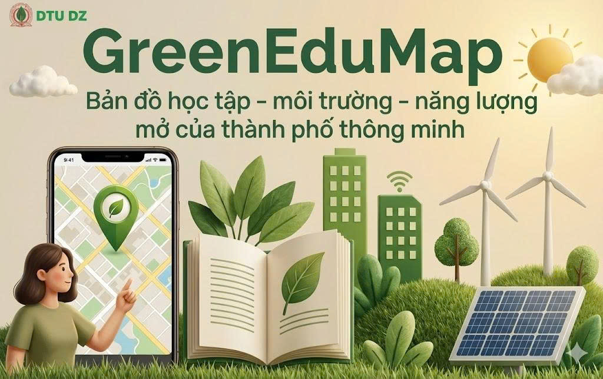

# 🌿 Giới thiệu về dự án GreenEduMap




GreenEduMap là hệ thống bản đồ 3D – dashboard – dữ liệu mở cho đô thị thông minh, hỗ trợ:

- **Chính quyền** → ra quyết định dựa trên dữ liệu.
- **Trường học** → triển khai giáo dục xanh (Green Skills).
- **Người dân** → xem chất lượng sống và nhận gợi ý hành động xanh.
- **Doanh nghiệp xanh** → tìm vị trí thích hợp để đầu tư CSR hoặc năng lượng tái tạo.

Nền tảng tích hợp dữ liệu phân tán từ OpenAQ, OpenWeather, Sentinel, dữ liệu giáo dục địa phương, dân cư… sau đó chuẩn hóa bằng NGSI-LD / Linked Open Data và hiển thị trực quan trên bản đồ 3D.

---

## 💫 2. Tại sao GreenEduMap quan trọng?

- Dữ liệu đô thị hiện tại rời rạc, khó truy cập, thiếu chuẩn hóa.
- Chính quyền thiếu công cụ phân tích nhiệt độ – ô nhiễm – năng lượng – giáo dục theo từng phường/xã.
- Trường học cần dữ liệu thật để dạy kỹ năng xanh.
- Người dân không có nguồn thông tin đáng tin cậy về chất lượng sống quanh mình.
- Cộng đồng thiếu hành vi xanh vì không biết bắt đầu từ đâu.

👉 GreenEduMap giải quyết toàn bộ bằng một nền tảng duy nhất.

---

## 🎯 3. Mục tiêu dự án

### 🎯 Mục tiêu tổng thể
Xây dựng bản đồ tri thức đô thị xanh nơi dữ liệu → AI → hành động xanh → cải thiện chất lượng sống.

### 🎯 Mục tiêu cụ thể
-  Chuẩn hóa dữ liệu môi trường – giáo dục – năng lượng theo NGSI-LD & LOD.
-  Hiển thị bản đồ 3D/2D lớp dữ liệu đa tầng.
-  Xây dựng AI phân tích tương quan & cụm hóa khu vực.
-  Gợi ý hành động xanh phù hợp từng cá nhân/khu vực.
-  Tạo hệ sinh thái giáo dục xanh (khóa học, hoạt động, tiến độ).

---

## 👥 4. Vai trò & phân quyền

| Vai trò | Khả năng | Màn hình |
| --- | --- | --- |
| 👨‍💻 Admin | Quản lý dữ liệu, phân quyền, cấu hình AI | Dashboard, Wards, Users, Logs |
| 🧑‍🏫 School | Khóa học xanh, học viên, báo cáo | Courses, Students, Activities |
| 👩‍💼 Citizen | Bản đồ, phản hồi, nhận gợi ý AI | Map, Feedback, Actions, Stats |

---

## 🧱 5. Kiến trúc hệ thống

```


```

---

## 🔄 6. Luồng xử lý (System Flow)

```
sequenceDiagram
    participant SRC as External Data (OpenAQ, Sentinel,...)
    participant ETL as ETL Pipeline
    participant DB as PostGIS DB
    participant LOD as NGSI-LD/LOD Layer
    participant BE as Backend (FastAPI)
    participant FE as Frontend (Next.js + CesiumJS)
    participant USER as User

    SRC->>ETL: Thu thập dữ liệu môi trường/giáo dục
    ETL->>DB: Làm sạch & lưu dữ liệu không gian
    ETL->>LOD: Cập nhật NGSI-LD Entities
    USER->>FE: Truy cập ứng dụng
    FE->>BE: Gửi yêu cầu API
    BE->>DB: Truy vấn dữ liệu GIS
    BE->>LOD: Truy vấn NGSI-LD
    BE-->>FE: Trả dữ liệu bản đồ + thống kê + AI
    FE-->>USER: Hiển thị bản đồ 3D + dashboard
```

---

## 🧩 7. Thành phần dữ liệu (Data Layers)

### ✔ Environmental Layer
- AQI, PM2.5, PM10, O₃, NO₂
- Nhiệt độ bề mặt (Sentinel)
- Cây xanh, mật độ phủ xanh
- Tiềm năng năng lượng mặt trời

### ✔ Educational Layer
- Trường học
- Hoạt động xanh
- Khóa học Green Skills

### ✔ Energy Layer
- Solar radiation
- Renewable potential heatmap

### ✔ AI Layer
- Clustering: Xanh – Vàng – Đỏ
- Correlation: Môi trường ↔ Giáo dục ↔ Dân cư
- Gợi ý hành động xanh

### ✔ LOD / NGSI-LD Layer
- RDF/JSON-LD
- Turtle
- SOSA/SSN
- Digital Twin cho từng phường/xã
---

## 🌿 8. Lợi ích mang lại

### 🌍 Minh bạch dữ liệu đô thị
Dữ liệu phân tán → chuẩn hóa → hiển thị trực quan.

### 🏛 Hỗ trợ quyết định cho chính quyền
- Xác định điểm nóng đô thị
- Quy hoạch cây xanh / năng lượng tái tạo
- Ưu tiên ngân sách theo mức độ rủi ro

### 🎓 Thúc đẩy giáo dục xanh
- Khóa học Green Skills
- Hoạt động dựa trên dữ liệu thật
- Chỉ số "Trường học xanh"

### 👨‍👩‍👧 Người dân chủ động hành động xanh
- Nhận cảnh báo môi trường
- Gợi ý hành động theo khu vực
- Theo dõi chất lượng sống quanh mình

---

## 📁 9. Cấu trúc thư mục

```
GreenEduMap
├── backend/            # FastAPI, services, AI models
├── frontend/           
├── app/           
├── docker/             # Deployment stack
├── data/               # SQL seeds, GeoJSON, raster
├── docs/               # Documentation, diagrams
├── scripts/            # ETL, LOD exports
└── .github/workflows/  # CI/CD pipelines
```

---

## 🗂 10. Dữ liệu & mô hình

- `users` – Admin, School, Citizen
- `schools`, `courses`, `enrollments`
- `air_quality`, `weather`, `energy_data`
- `citizen_feedback`
- `ai_analysis`, `ai_clusters`

**Bảng GIS:** `geometry(Point, 4326)` + GiST Index  
**LOD Export:** JSON-LD / Turtle / RDF-XML, FiWARE Smart Data Models, W3C SOSA/SSN

---

## 🧪 11. Kiểm thử

```bash
cd backend
pytest -v --cov=app

cd frontend
npm run test
```

---

## 📄 12. Tài liệu liên quan

| File | Mô tả |
| --- | --- |
| `docs/architecture.md` | Kiến trúc chi tiết |
| `docs/api_reference.md` | API đầy đủ |
| `docs/open_data_standards.md` | NGSI-LD, SOSA/SSN, LOD |
| `CONTRIBUTING.md` | Quy tắc đóng góp |

---

## 🤝 13. Đóng góp

1. Fork repo
2. Tạo branch `git checkout -b feature/my-feature`
3. Viết test + cập nhật docs
4. `git commit -m "feat: add xyz"`
5. `git push` & mở Pull Request

Tuân thủ Conventional Commits & Code Style của dự án.

---

## 👥 14. Team Members

| Vai trò | Thành viên | Email |
| --- | --- | --- |
| Leader | Nguyễn Quốc Long | quoclongdng@gmail.com |
| Developer | Trần Xuân Trường | xuantruong081205@gmail.com |
| Developer | Hồ Dương Quốc Huy | huyho2782005@gmail.com |
| Developer | Lê Tuấn Minh | llttminh@gmail.com |

---

## 📜 15. License

MIT License – xem file `LICENSE` để biết chi tiết.

---

🎉 **GreenEduMap – Built for OLP 2025 Smart City Challenge**  
🌿 *Empowering sustainable cities through open data and education.*
