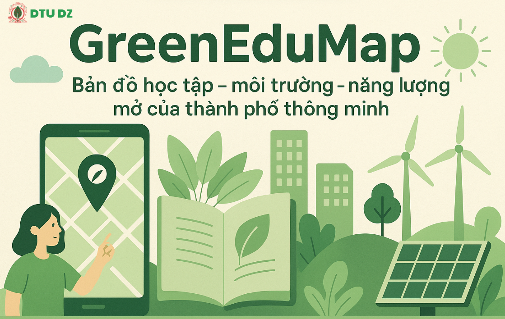
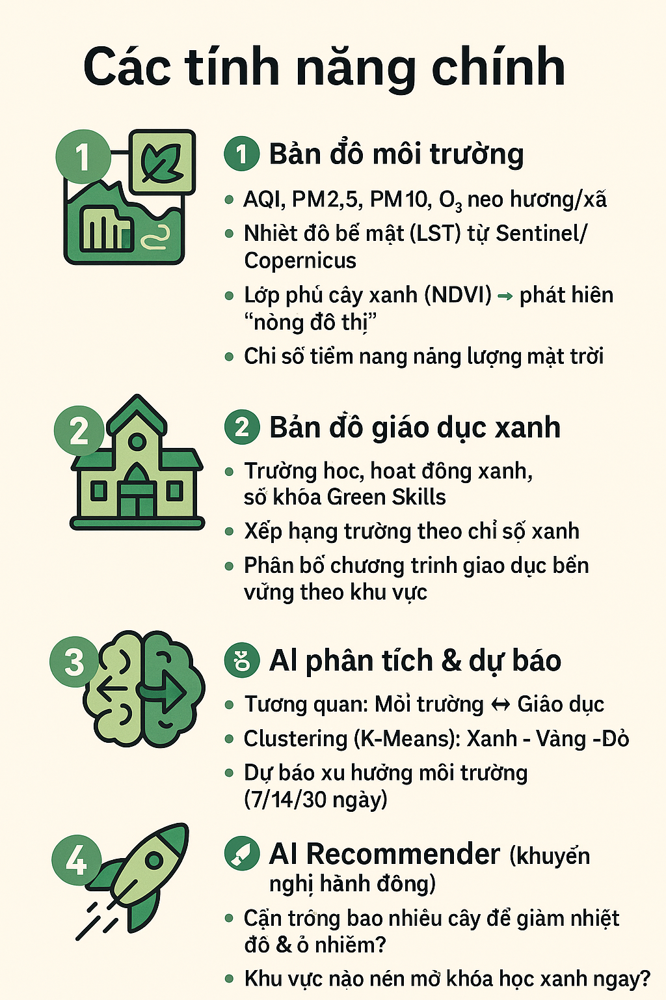
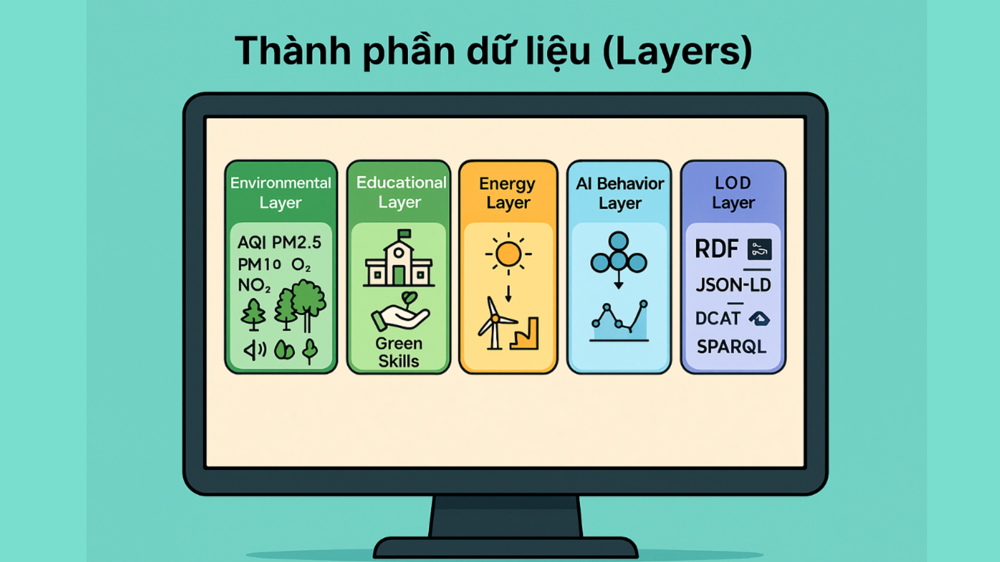
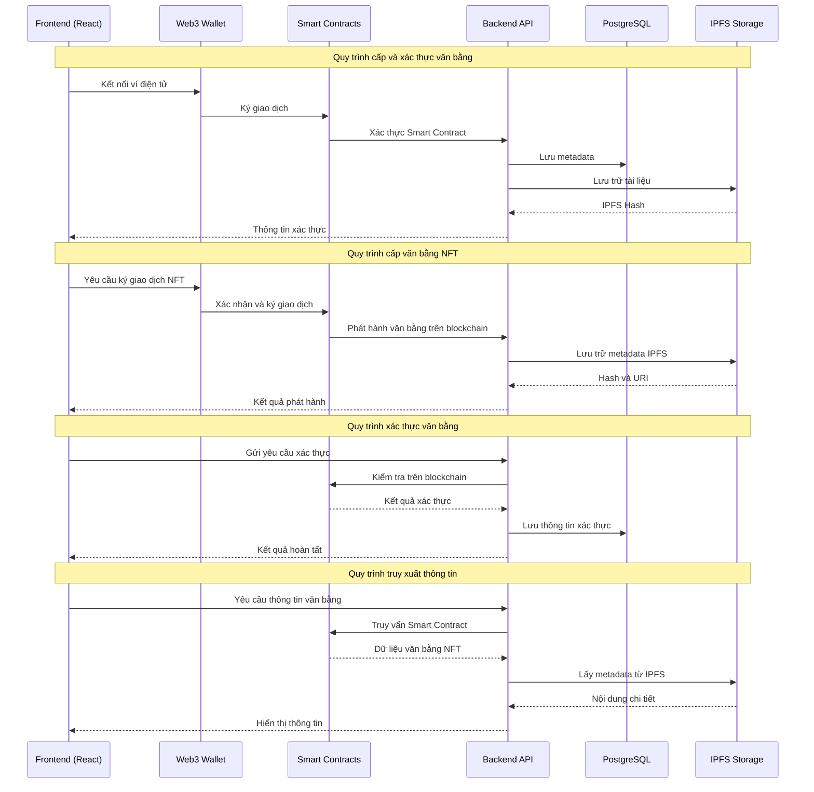

# 🌿 Giới thiệu về dự án GreenEduMap



> *"Xanh hơn mỗi ngày – Dữ liệu vì cộng đồng xanh 🌍"*

**GreenEduMap** là hệ thống bản đồ học tập – môi trường – năng lượng mở của đô thị thông minh.  
Dự án xây dựng **hệ sinh thái dữ liệu mở phục vụ đô thị học tập xanh**, kết nối ba lĩnh vực: **môi trường – năng lượng – giáo dục cộng đồng** để giúp người dân, trường học và chính quyền ra quyết định dựa trên dữ liệu thật.

✅ Trực quan hóa dữ liệu theo phường/xã  
✅ Cảnh báo và phân tích xu hướng môi trường  
✅ Đánh giá chỉ số giáo dục xanh (Green Skills)  
✅ Gợi ý hành động xanh theo từng khu vực  
✅ Tích hợp Linked Open Data (RDF/JSON-LD)

Tác giả: **DTU_GreenCity Team**

---

# 💫 Tại sao GreenEduMap quan trọng?

Trong bối cảnh các đô thị đang phát triển với tốc độ chưa từng có, chúng ta đang đối mặt với hàng loạt thách thức: ô nhiễm không khí gia tăng, hiệu ứng đảo nhiệt đô thị, mật độ xây dựng dày đặc, thiếu quy hoạch cây xanh, cùng với đó là sự phân mảnh trong dữ liệu giáo dục – môi trường – năng lượng khiến việc ra quyết định trở nên kém hiệu quả.

 Ở nhiều địa phương, dữ liệu tồn tại rời rạc, khó truy cập, khó liên thông — và kết quả là các kế hoạch phát triển xanh thường bị chậm, thiếu chính xác, hoặc thiếu cơ sở khoa học rõ ràng.

Chính trong bối cảnh ấy, GreenEduMap được tạo ra như một nền tảng tiên phong, đưa việc quản lý đô thị lên một tầm cao mới, nơi
- Dữ liệu được minh bạch.
- Quyết định được dẫn dắt bởi bằng chứng khoa học.
- Cộng đồng được trao quyền hành động xanh.
- Giáo dục bền vững được khơi nguồn từ dữ liệu thật.

## Đây là những lý do khiến GreenEduMap trở thành một nền tảng thiết yếu, có giá trị lâu dài, và đóng vai trò nền tảng cho các đô thị thông minh hiện đại.

### 🌍 **Minh bạch hóa dữ liệu đô thị**  
 #### GreenEduMap không chỉ đơn thuần hiển thị số liệu; nền tảng kết nối – chuẩn hóa – mở hóa toàn bộ dữ liệu về môi trường, giáo dục và năng lượng của thành phố  Những dữ liệu từng nằm rải rác ở các đơn vị nay được hợp nhất thành một bản đồ thống nhất, trực quan và dễ tra cứu như.
- Hiển thị AQI, PM2.5, PM10, nhiệt độ bề mặt từng khu vực.
- Theo dõi mật độ cây xanh, chỉ số phủ xanh, mức độ hấp thụ carbon.
- Công khai chỉ tiêu giáo dục, hoạt động xanh của các trường học.
- Kết nối dữ liệu từ nhiều nguồn theo chuẩn Linked Open Data, đảm bảo chất lượng và tính tương thích quốc tế.
#### Nhờ đó, GreenEduMap đặt nền móng cho một đô thị minh bạch, nơi mọi thành phần xã hội đều có thể tiếp cận và sử dụng dữ liệu đáng tin cậy.

### 📊 **Phân tích thông minh bằng AI**  
#### GreenEduMap tích hợp các mô hình phân tích và dự báo dựa trên AI, cho phép
- Xác định **“điểm nóng ô nhiễm”** theo từng thời điểm.
- Dự báo **khu vực nguy cơ cao** khi nhiệt độ tăng nhanh hoặc mật độ giao thông lớn.
- Phân tích mối liên hệ giữa **chất lượng môi trường và chất lượng học tập**.
- Đề xuất khu vực cần ưu tiên trồng cây, lắp đặt năng lượng mặt trời, hoặc mở rộng không gian xanh.
#### Nền tảng không chỉ cung cấp dữ liệu — mà còn giúp **giải thích dữ liệu**, biến dữ liệu thành tri thức và tri thức thành **giải pháp**.

### 🧠 **Công cụ đắc lực cho chính quyền và trường học**  
#### GreenEduMap tạo ra một “trợ lý số” hỗ trợ các quyết định quan trọng
- Lập kế hoạch **quy hoạch cây xanh** dựa trên mật độ dân cư và nhu cầu giảm nhiệt.
- Xây dựng **lớp học xanh**, tối ưu ánh sáng tự nhiên và chất lượng không khí.
- Phân bổ ngân sách môi trường – giáo dục dựa trên **chỉ số ưu tiên khoa học**.
- Theo dõi hiệu quả của các chương trình trồng cây, chiến dịch xanh hoặc dự án CSR.
#### Đối với trường học, dữ liệu môi trường theo thời gian thực giúp
- Tổ chức các hoạt động giáo dục xanh dựa trên số liệu thật.
- Cho học sinh **“trải nghiệm khoa học sống”**, học STEAM từ dữ liệu ngay quanh trường.
- Đánh giá mức độ **“xanh hoá”** của nhà trường dựa trên tiêu chí rõ ràng.

### 🔥 **Theo dõi dữ liệu thời gian thực**  
#### GreenEduMap cập nhật liên tục các chỉ số
- Chất lượng không khí (AQI, PM2.5, CO₂…)
- Nhiệt độ bề mặt và hiệu ứng đảo nhiệt
- Bức xạ mặt trời - tiềm năng năng lượng tái tạo
- Mật độ cây xanh và chỉ số hấp thụ nhiệt
- Hoạt động giáo dục, phong trào xanh, mức độ tham gia của cộng đồng
#### Nhờ đó, cả thành phố có thể nhìn thấy **những chuyển biến môi trường theo từng giờ, từng ngày**, giúp việc hành động trở nên nhanh hơn và chính xác hơn.

### 🤝 **Kết nối cộng đồng – hành động xanh**  
#### GreenEduMap không chỉ phục vụ các trung tâm đô thị mà **hướng đến mọi công dân, ở mọi khu vực,** từ nội thành đến vùng ven, từ khu dân cư đến trường học nông thôn giúp.
- Người dân theo dõi chất lượng sống nơi mình ở.
- Doanh nghiệp lựa chọn điểm triển khai dự án CSR hiệu quả nhất.
- Trường học, giáo viên, học sinh đề xuất hoạt động xanh và theo dõi kết quả.
- Cộng đồng có nơi để **ghi nhận — chia sẻ — lan tỏa** những sáng kiến xanh.
#### GreenEduMap tạo ra một **hệ sinh thái kết nối,** nơi mỗi cá nhân, tổ chức, doanh nghiệp đều có thể trở thành “tác nhân thay đổi”.

## 🌱 GreenEduMap – Nền tảng dữ liệu xanh cho mọi đô thị, mọi con người
### Không phải chỉ dành cho trung tâm đô thị thông minh — GreenEduMap hướng đến:
- Mọi người dân, ở bất kỳ đâu.
- Mọi trường học, từ thành phố đến nông thôn.
- Mọi tổ chức, cần dữ liệu để hành động xanh.
- Mọi doanh nghiệp, cần minh bạch và định hướng đầu tư xanh đúng chỗ.
- Mọi chính quyền, mong muốn điều hành bằng dữ liệu chuẩn xác.
### GreenEduMap không chỉ là một dự án; đó là tầm nhìn cho một tương lai đô thị bền vững, nơi dữ liệu dẫn lối cho sự phát triển, và mọi người đều có thể góp phần xây dựng một thế giới xanh hơn.

---

# ✅ Mục tiêu dự án
## 🎯 Mục tiêu tổng thể

Xây dựng **bản đồ tri thức đô thị xanh**, nơi dữ liệu môi trường – giáo dục – năng lượng được kết nối, phân tích và phục vụ cộng đồng.

## � Mục tiêu theo đối tượng

✔ **Người dân**  
- Xem bản đồ chất lượng sống  
- Hiểu tác động của môi trường lên sức khỏe và học tập  
- Nhận gợi ý hành động xanh (trồng cây, tiết kiệm năng lượng, tái chế)

✔ **Trường học & giáo viên**  
- Tích hợp dữ liệu môi trường thật vào bài giảng  
- Tổ chức khóa học “Green Skills”  
- Đánh giá mức độ xanh của trường

✔ **Chính quyền đô thị**  
- Ra quyết định quy hoạch cây xanh, năng lượng, cơ sở giáo dục  
- Theo dõi khu vực ô nhiễm và xu hướng thay đổi  
- Ưu tiên ngân sách cho địa bàn cần cải thiện

✔ **Doanh nghiệp xã hội – CSR**  
- Xác định khu vực nên tài trợ hoặc phát triển năng lượng tái tạo  
- Công khai hiệu quả các chiến dịch bảo vệ môi trường

---

# 🔍 Các tính năng chính

## 🗺 1. Bản đồ môi trường
- AQI, PM2.5, PM10, O3, NO2 theo từng phường/xã
- Nhiệt độ bề mặt từ vệ tinh Sentinel/Copernicus
- Lớp phủ cây xanh → phát hiện vùng “nóng đô thị”
- Chỉ số tiềm năng năng lượng mặt trời

## � 2. Bản đồ giáo dục xanh
- Trường học, hoạt động xanh, số khóa học “Green Skills”
- Xếp hạng trường theo chỉ số xanh
- Phân bố chương trình giáo dục bền vững

## 🧠 3. AI phân tích & dự báo
- Phân tích tương quan: **Môi trường ↔ Giáo dục**
- Clustering (K-Means) phân loại: **Xanh – Vàng – Đỏ**
- Dự báo xu hướng môi trường

## 🚀 4. AI Recommender
- Trồng bao nhiêu cây để giảm nhiệt độ & ô nhiễm?
- Khu vực nào cần mở khóa học xanh ngay?
- Nơi nào phù hợp để lắp pin mặt trời?
- Ưu tiên hành động theo tác động – chi phí – dân số

---

# 🧱 Kiến trúc hệ thống

```text
[OpenAQ / OpenWeather / Sentinel / Open Data Giáo dục]
│
▼
ETL Pipeline (Airflow)
- Collector API
- Làm sạch dữ liệu
- Chuyển đổi GeoJSON/CSV/Raster
│
▼
PostgreSQL + PostGIS + Tileserver
+ RDF/JSON-LD + DCAT
│
▼
FastAPI Backend
/env /edu /ml /recommend /lod
│
▼
Vue3 + MapboxGL/CesiumJS

Bản đồ 3D

Dashboard

Time series chart
```

---

# 🧩 Thành phần dữ liệu (Layers)


### ✅ Environmental Layer
- AQI, PM2.5, PM10, tiếng ồn, cây xanh
- Nguồn: OpenAQ, OpenWeather, Copernicus, Sentinel

### ✅ Educational Layer
- Trường học, kỹ năng xanh, hoạt động cộng đồng
- Nguồn: data.moet.gov.vn, open data CSV

### ✅ Energy Layer
- Năng lượng mặt trời / gió
- Hiển thị heatmap vùng tiềm năng

### ✅ AI Behavior Layer
- Tương quan dữ liệu
- Gợi ý hành động xanh

### ✅ LOD Layer
- RDF + JSON-LD
- SPARQL endpoint
- Kết nối ChatGov AI / City Open Data

---

## 📌 Lợi ích mang lại

### 🌿 Minh bạch dữ liệu môi trường – giáo dục  
#### GreenEduMap xây dựng một nền tảng dữ liệu mở, tích hợp nhiều nguồn thông tin quan trọng của đô thị
- Chất lượng không khí (AQI, PM2.5, PM10, O₃, NO₂…)
- Mật độ và phân bố cây xanh theo khu vực
- Nhiệt độ bề mặt và bản đồ “điểm nóng đô thị” từ ảnh vệ tinh
- Hoạt động giáo dục xanh, chương trình kỹ năng bền vững
- Chỉ số tiềm năng năng lượng mặt trời
####  Hệ thống cho phép hiển thị thông tin theo từng **phường/xã** với độ chính xác cao, giúp người dân, trường học, doanh nghiệp và chính quyền tiếp cận dữ liệu **một cách minh bạch, trực quan và tin cậy**. Điều này góp phần giảm tình trạng thiếu thông tin, dữ liệu rời rạc và khó truy cập trong quản lý đô thị truyền thống.

### 🏛 Công cụ ra quyết định cho chính quyền đô thị 
#### GreenEduMap cung cấp bộ công cụ phân tích mạnh mẽ, giúp chính quyền
- Theo dõi xu hướng ô nhiễm không khí theo thời gian
- Xác định khu vực có rủi ro cao: ít cây xanh, nóng đô thị, dân cư đông
- Lập kế hoạch **trồng cây, cooling urban design, năng lượng tái tạo**
- Ưu tiên ngân sách dựa trên phân tích chi phí – tác động
- Đánh giá hiệu quả sau các chiến dịch can thiệp (ví dụ: tăng cây xanh → giảm nhiệt độ)
#### Các quyết định về **quy hoạch đô thị, giáo dục, năng lượng** trở nên **khoa học – nhanh – chính xác**, giúp cải thiện chất lượng sống và giảm thiểu tác động của biến đổi khí hậu.

### 👥 Nâng cao nhận thức và hành động của cộng đồng 
#### GreenEduMap giúp cộng đồng hiểu rõ hơn về môi trường xung quanh mình thông
- Bản đồ chất lượng sống theo khu vực
- Cảnh báo khu vực ô nhiễm hoặc có nguy cơ cao
- Gợi ý hành động xanh phù hợp cho từng hộ gia đình
- Thông tin minh bạch về các chiến dịch môi trường đang diễn ra
#### Người dân có thể 
- Tiết giảm năng lượng
- Trồng thêm cây xanh trước nhà
- Tham gia tái chế, giảm rác thải
- Theo dõi sự thay đổi môi trường theo thời gian
#### Nhờ đó, GreenEduMap thúc đẩy tư duy mỗi cá nhân là một phần của giải pháp, hình thành cộng đồng đô thị sống xanh và có trách nhiệm.
### 🎓 Thúc đẩy giáo dục bền vững (Green Skills)
#### Nền tảng hỗ trợ trường học và giáo viên bằng cách
- Cung cấp dữ liệu môi trường thật để đưa vào bài giảng
- Hỗ trợ tổ chức hoạt động xanh dựa trên điều kiện thực tế của địa phương
- Gợi ý các khóa học và chương trình về **Green Skills**
- Tạo công cụ đánh giá mức độ “xanh hóa” của từng cơ sở giáo dục
- Kết nối nhà trường – học sinh – gia đình – cộng đồng
#### Nhờ việc gắn kết dữ liệu thật với giáo dục, dự án giúp học sinh – sinh viên
- Hiểu rõ mối quan hệ giữa môi trường, đô thị và đời sống
- Rèn tư duy phân tích, nghiên cứu khoa học
- Hình thành ý thức bảo vệ môi trường ngay từ sớm
- Phát triển năng lực công dân xanh của tương lai
#### Từ đó xây dựng thế hệ học sinh – sinh viên có tư duy phát triển bền vững.

###  📚 Hỗ trợ mạnh mẽ cho nghiên cứu khoa học 
#### GreenEduMap được thiết kế như một hệ sinh thái dữ liệu mở, tích hợp Linked Open Data (LOD).
#### Điều này tạo điều kiện thuận lợi 
- Giảng viên, sinh viên, nhà nghiên cứu phân tích dữ liệu đô thị
- Thực hiện mô hình hóa xu hướng môi trường – năng lượng
- Nghiên cứu tác động của chất lượng môi trường lên giáo dục
- Nghiên cứu đô thị thông minh, biến đổi khí hậu và phát triển bền vững
#### Các dữ liệu chuẩn hóa (GeoJSON, Raster, RDF/JSON-LD…) giúp
- Dễ dàng tích hợp vào bài báo khoa học
- Hỗ trợ xây dựng mô hình AI, Machine Learning
- Tăng chất lượng luận văn, đồ án, đề tài nghiên cứu
- Từ đó giúp giảng viên, sinh viên, chuyên gia truy cập, phân tích và phát triển các mô hình khoa học về môi trường – năng lượng – giáo dục.
- Tạo tiền đề cho các nghiên cứu đa ngành chất lượng cao.
###  💼  Khuyến khích doanh nghiệp xanh đầu tư đúng điểm
#### GreenEduMap giúp doanh nghiệp (đặc biệt là CSR & năng lượng tái tạo) xác định những khu vực cần ưu tiên
- Khu vực nóng đô thị và thiếu cây xanh
- Vùng có chỉ số ô nhiễm cao
- Địa bàn còn thiếu chương trình giáo dục xanh
- Nơi có tiềm năng lớn cho năng lượng mặt trời
#### Nền tảng cung cấp dữ liệu để doanh nghiệp
- Đầu tư trồng cây hoặc tài trợ giáo dục môi trường
- Xây dựng trạm năng lượng mặt trời tại vị trí tối ưu
- Đo lường hiệu quả của các hoạt động CSR một cách minh bạch
- Tăng uy tín thương hiệu xanh theo hướng bền vững
#### Đây là cầu nối giữa doanh nghiệp – chính quyền – cộng đồng, giúp các khoản đầu tư xanh phát huy đúng giá trị.

---

## 🌏 Đối tượng hướng đến

### 👨‍👩‍👧‍👦 Người dân
#### GreenEduMap được thiết kế để phục vụ mọi người dân, từ cư dân thành thị, người sống tại vùng ven đô, đến cộng đồng nông thôn nơi chịu tác động trực tiếp của biến đổi khí hậu và môi trường.
#### Nền tảng mang đến cho người dân
- Thông tin minh bạch về chất lượng không khí, tiếng ồn, mật độ cây xanh, nhiệt độ bề mặt, năng lượng tiêu thụ và hoạt động giáo dục quanh khu vực sinh sống.
- Quyền tiếp cận dữ liệu mà trước đây chỉ có các cơ quan chuyên môn nắm giữ.
#### Khả năng lựa chọn lối sống xanh dựa trên khoa học
- chọn giờ ra đường ít ô nhiễm,
- tối ưu điện năng gia đình,
- trồng cây phù hợp khí hậu địa phương,
- tham gia các chương trình cộng đồng dựa trên dữ liệu.
- Sự an tâm khi theo dõi các chỉ số môi trường quan trọng ảnh hưởng trực tiếp đến sức khỏe và đời sống thường nhật.

#### GreenEduMap giúp người dân ở mọi vùng địa lý trở thành người tiêu dùng thông minh, công dân hiểu biết và thành viên chủ động trong quá trình xây dựng cộng đồng xanh – sạch – bền vững.

### 🏛 Chính quyền đô thị & chính quyền địa phương
#### Dù là thành phố lớn, thị xã hay huyện nông thôn, các cấp chính quyền đều cần dữ liệu chính xác để quản lý địa phương hiệu quả hơn. GreenEduMap cung cấp
- Hệ thống theo dõi chất lượng môi trường theo phường/xã/thôn/bản
- Công cụ phát hiện “điểm nóng” cần ưu tiên xử lý
- Bản đồ rủi ro môi trường theo thời gian thực
- Gợi ý quy hoạch cây xanh, năng lượng tái tạo, công trình công cộng
- Dữ liệu hỗ trợ lập báo cáo định kỳ và đánh giá tác động phát triển kinh tế – xã hội
#### GreenEduMap giúp chính quyền nâng cao
- Hiệu quả quản trị (governance)
- Tính minh bạch (transparency)
- Khả năng phản ứng nhanh (responsiveness)
- Mức độ hài lòng của người dân
#### Đây là nền tảng giúp các địa phương tiến gần hơn đến mô hình quản lý thông minh và phát triển kinh tế xanh.


### 🎓 Trường học – giáo viên - Học sinh
#### GreenEduMap hỗ trợ toàn bộ hệ sinh thái giáo dục, từ mầm non, tiểu học đến đại học và sau đại học
#### Giáo viên được hỗ trợ:
- Bài giảng sống động với dữ liệu thời gian thực
- Tài liệu minh họa trực quan về môi trường địa phương
- Khả năng tổ chức giờ học ngoài trời, dự án STEM, nghiên cứu nhóm
#### Học sinh được truyền cảm hứng
- Hiểu rõ tác động của môi trường đến cuộc sống hằng ngày
- Mạnh dạn nghiên cứu khoa học nhờ dữ liệu mở
- Phát triển kỹ năng xanh (Green Skills) – xu hướng giáo dục toàn cầu
#### Nhà trường được trang bị
- Bộ chỉ số đánh giá mức độ “xanh hóa” theo chuẩn
- Công cụ theo dõi hiệu quả các hoạt động môi trường
- Báo cáo định lượng để tham gia giải thưởng, chương trình quốc tế
#### GreenEduMap đồng hành cùng ngành giáo dục trong việc xây dựng thế hệ trẻ có tư duy bền vững, năng lực phân tích và tinh thần trách nhiệm với môi trường.

### 📚 Nhà nghiên cứu & chuyên gia
#### Dự án mang đến nền tảng dữ liệu mở chuẩn quốc tế, là nguồn lực quý giá cho các nhóm nghiên cứu
- Môi trường & khí tượng
- Năng lượng tái tạo
- Quy hoạch – kiến trúc – đô thị học
- Công nghệ thông tin – AI – mô hình dự báo
- Xã hội học – giáo dục học – hành vi cộng đồng
#### Các chuyên gia có thể
- Truy cập dữ liệu dạng thô hoặc phân lớp
- Kết nối API mở để xây dựng mô hình phân tích
- Tạo ra các bài báo khoa học, đề tài nghiên cứu, mô phỏng môi trường
- Học tập, so sánh và thử nghiệm nhiều kịch bản khác nhau
#### GreenEduMap góp phần hình thành hệ sinh thái tri thức rộng mở, thúc đẩy khoa học và công nghệ phát triển vì lợi ích chung của xã hội.

### 💼 Doanh nghiệp năng lượng & CSR
#### GreenEduMap hỗ trợ doanh nghiệp
- Xác định nơi cần trồng cây để giảm nhiệt đô thị
- Chọn khu vực thích hợp để lắp đặt năng lượng mặt trời
- Tìm vùng đang thiếu cơ hội giáo dục xanh để đầu tư
- Theo dõi hiệu quả CSR bằng dữ liệu định lượng
- Bảo vệ thương hiệu thông qua minh bạch hóa tác động môi trường
#### Các doanh nghiệp không chỉ thực hiện trách nhiệm xã hội mà còn tăng sức cạnh tranh, thu hút nhà đầu tư và xây dựng hình ảnh doanh nghiệp phát triển bền vững.
### 🌿 Các tổ chức môi trường – Tổ chức phi lợi nhuận – Nhóm cộng đồng môi trường
#### Với GreenEduMap, các tổ chức môi trường có thể
- Theo dõi các vấn đề môi trường theo khu vực
- Xây dựng chiến dịch truyền thông dựa trên dữ liệu thật
- Huy động lực lượng tình nguyện đúng nơi, đúng thời điểm
- Lập báo cáo khoa học phục vụ vận động chính sách
- Đo lường tác động của dự án trồng cây, làm sạch kênh rạch, giảm nhiệt đô thị…
#### Nền tảng là công cụ mạnh mẽ giúp các tổ chức nâng cao năng lực giám sát cộng đồng, từ đó thúc đẩy sự thay đổi tích cực và bền vững.

---

## ✅ Một vài use-case thực tế

| Tình huống | GreenEduMap hỗ trợ |
|------------|--------------------|
| Khu vực đông dân, nóng đô thị | Gợi ý trồng cây bóng mát → giảm 2–4°C |
| Trường học thiếu chương trình xanh | Đề xuất mở lớp Green Skills |
| Doanh nghiệp CSR tìm nơi tài trợ | Chỉ ra phường nguy cơ cao, ít cây xanh |
| Chính quyền muốn đo hiệu quả trồng cây | Dashboard so sánh trước & sau 6 tháng |

---

## 🏗 Cấu trúc dự án

```text
greenedumap/
├─ backend/
│  ├─ app/
│  │  ├─ api/
│  │  ├─ ml/
│  │  ├─ models/
│  │  └─ services/
│  └─ requirements.txt
├─ frontend/
│  ├─ src/
│  └─ public/
├─ data/
│  ├─ geojson/
│  ├─ sentinel/
│  └─ openaq/
├─ docs/
│  ├─ api.md
│  └─ setup.md
└─ assets/
     └─ images/
```
---
## 📚 Hướng dẫn cài đặt
### ✅ Yêu cầu hệ thống

Node.js ≥ 16

Python ≥ 3.9

PostgreSQL + PostGIS

Docker & Docker Compose
---
### ✅ Chạy Backend
```bash
cd backend
pip install -r requirements.txt
uvicorn app.main:app --reload
```
---
### ✅ Chạy Frontend

```bash
cd frontend
npm install
npm run dev

```
---
### ✅ Docker
```bash
docker-compose up -d
```
---
### 🔌 API Endpoints
```http
GET /env/summary
GET /edu/schools
GET /ml/cluster
GET /ml/corr
POST /recommend
```
---
### 📑 Tài liệu chi tiết

API Docs: docs/api.md

Setup Guide: docs/setup.md

Data Dictionary: docs/data.md (dự kiến)
---
### 🤝 Đóng góp

Fork dự án

Tạo branch mới (feature/my-feature)

Commit (git commit -m "add feature")

Tạo Pull Request
---
### 🐛 Báo lỗi

Mô tả lỗi, bước tái hiện, ảnh chụp màn hình

Gửi vào mục Issues khi public repo
---
### 📝 License

(Thêm khi mở source)
---
## "Xanh hơn – Thông minh hơn – Dữ liệu mở vì cộng đồng 🌱" sửa file này theo nội dung này vẫn giữ nguyên cấu trúc nha

Ba nhóm đối tượng chính:

| � Người học | � Cơ sở đào tạo | 💼 Nhà tuyển dụng |
|----------------|-------------|-------------------|
| Quản lý hồ sơ học tập trọn đời | Số hóa quy trình cấp văn bằng | Xác thực văn bằng nhanh chóng |

---

## 🏗️ Kiến trúc hệ thống


| Tầng | Công nghệ chính | Vai trò | Điểm nổi bật |
|-------|-------------------|------|-----------|
| **Blockchain** | Ethereum, Smart Contracts | Lưu trữ và xác thực văn bằng | Bất biến, minh bạch |
| **Backend** | Node.js, Express | API và xử lý nghiệp vụ | Khả năng mở rộng cao |
| **Frontend** | React, Web3.js | Giao diện người dùng | UX thân thiện, tích hợp ví điện tử |
| **Storage** | IPFS, MongoDB | Lưu trữ metadata và tài liệu | Phi tập trung, bảo mật |
| **Smart Contracts** | Solidity + OpenZeppelin | Quản lý văn bằng NFT | Tính bất biến, tự động hóa |
| **SSI Layer** | DIDs + Verifiable Credentials | Quản lý định danh số | Chủ quyền dữ liệu |
| **API Gateway** | Express + GraphQL | Tích hợp bên thứ ba | Dễ dàng mở rộng |
| **Database** | PostgreSQL | Dữ liệu quan hệ, cache | Hiệu năng cao, bảo mật |
| **Security** | JWT, OAuth2 | Xác thực, phân quyền | Đa tầng bảo mật |
| **Analytics** | Elastic Stack | Phân tích, báo cáo | Theo dõi thời gian thực |

---

## 🔄 Luồng xử lý



### Giải thích các luồng chính:

1. **Cấp phát văn bằng**: Smart Contract tự động hóa quy trình, đảm bảo tính minh bạch.
2. **Xác thực văn bằng**: Kiểm tra tức thì trên blockchain, không thể giả mạo.
3. **Lưu trữ phi tập trung**: Metadata được lưu trên IPFS, đảm bảo tính bền vững.
4. **Truy xuất thông tin**: Dễ dàng tra cứu và xác minh thông tin văn bằng.

## ⚙️ Yêu cầu hệ thống
| Software     | Minimum Version       |
| ------------ | -------------------- |
| **Node.js**  | >= 16.0.0           |
| **Truffle**  | >= 5.0.0            |
| **Web3.js**  | >= 1.8.0            |
| **React**    | >= 18.0.0           |
| **MetaMask** | Phiên bản mới nhất  |
| **IPFS**     | >= 0.12.0           |
| **Vite** | 6.2.4 |

## 🚀 Hướng dẫn cài đặt

### 🌐 Triển khai hệ thống

```bash
# 1. Clone mã nguồn
git clone https://github.com/EduTraceBridge/platform.git
cd platform

# 2. Cài đặt dependencies
npm install

# 3. Biên dịch Smart Contracts
truffle compile

# 4. Khởi động blockchain local
ganache-cli

# 5. Triển khai Smart Contracts
truffle migrate

# 2. Create config file
cp .env.example .env
# ✏️ Fill in Database, RPC endpoints, Pinata API key

# 3. Build & Deploy
./scripts/deploy-ecs.sh

```

### 💻 Local Development

#### Backend Setup
```bash
composer i 
npm i
php artisan migrate
php artisan db:seed
npm run watch
php artisan server
```


### Demo Accounts
You can use the following accounts for demo:

**ADMIN :**

- Email: admin@gmail.com
- Password: 123456

**STUDENT :**

***Account 1***
- Email: anh.nm220001@dtu.edu.vn
- Password: 123456

***Account 2***
- Email: binh.tv220002@sis.hust.edu.vn
- Password: 123456

**SCHOOL:**

***Account 1***
- Email: admin@dtu.edu.vn
- Password: 123456

***Account 2***
- Email: admin@uet.vnu.edu.vn
- Password: 123456

**LECTURER:**

***Account 1***
- Email: nguyenquoclong@dtu.edu.vn
- Password: 123456


***Account 2***
- Email: lehoangnam@hust.edu.vn
- Password: 123456

**BUSINESS:**

***Account 1***
- Email: hr@fpt.com.vn
- Password: 123456

***Account 2***
- Email: tuyen.dung@viettel.com.vn
- Password: 123456

## 🧑‍💻 Contribution

```bash
# 1. Fork the repository and clone to local
git clone git@gitlab.com:ThanhTruong2311/blockchain_dtudz.git
cd blockchain_dtudz

# 2. Create a new branch for the feature
git checkout -b feat/my-awesome-feature

# 3. Commit following Conventional Commits
git add .
git commit -m "feat: add new awesome feature"

# 4. Push and create a Pull Request
git push origin feat/my-awesome-feature
# 🔀 Create a Pull Request on GitLab
```

### 📋 Contribution Guidelines
- ✅ Follow [Conventional Commits](https://www.conventionalcommits.org/)
- ✅ Write tests for new code
- ✅ Ensure code passes all CI/CD checks
- ✅ Update documentation if needed


## 👥 Team Members
| Role      | Name                    | Email                                                                 |
| --------- | ----------------------- | --------------------------------------------------------------------- |
| Leader    | **Nguyễn Quốc Long**     | [quoclongdng@gmail.com](mailto:quoclongdng@gmail.com)                 |
| Developer | **Trần Xuân Trường**      | [xuantruong081205@gmail.com](mailto:xuantruong081205@gmail.com) |
| Developer | **Hồ Dương Quốc Huy**          | [huyho2782005@gmail.com](mailto:huyho2782005@gmail.com)                     |
| Developer | **Lê Tuấn Minh**      | [llttminh@gmail.com](mailto:llttminh@gmail.com)             |


## 📜 License
Released under the MIT License – see LICENSE file for details.

© 2025 EduBridgeTrace – Build trust, unlock opportunity.


