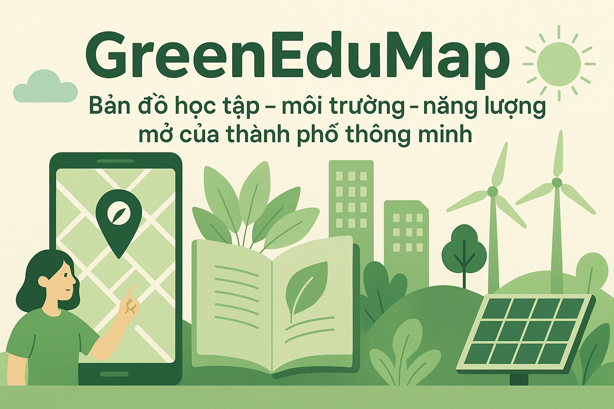

# 🌿 Giới thiệu về dự án GreenEduMap



> *"Xanh hơn mỗi ngày – Dữ liệu vì cộng đồng xanh 🌍"*

**GreenEduMap** là hệ thống bản đồ học tập – môi trường – năng lượng mở của đô thị thông minh.  
Dự án giúp người dân, nhà quản lý và trường học xem dữ liệu chất lượng sống theo phường/xã, phân tích xu hướng, cảnh báo khu vực rủi ro, và đề xuất hành động xanh.

Dự án được phát triển với định hướng **Open Data + AI + Bản đồ 3D**, sử dụng các nguồn dữ liệu công khai như OpenAQ, OpenWeather, Sentinel, Open Data giáo dục.

<!-- Được open source theo giấy phép [MIT License](LICENSE).   -->
Tác giả: **DTU_GreenCity Team**

---

# 💫 Tại sao GreenEduMap quan trọng?

- 🌍 **Đô thị xanh, minh bạch dữ liệu**  
  Dữ liệu môi trường và giáo dục thường rời rạc — GreenEduMap gom toàn bộ về một bản đồ mở duy nhất, trực quan và minh bạch.

- 📊 **AI phân tích tương quan môi trường – học tập xanh**  
  Xác định khu vực cần ưu tiên trồng cây, mở lớp học xanh, cải thiện hạ tầng năng lượng.

- 🔥 **Cảnh báo sớm & dữ liệu thời gian thực**  
  Theo dõi chất lượng không khí, nhiệt độ bề mặt, ô nhiễm theo ngày/giờ.

- 🧠 **Hỗ trợ ra quyết định cho chính quyền & trường học**  
  Báo cáo tự động, bản đồ tương tác, biểu đồ xu hướng.

- 🤝 **Kết nối cộng đồng – hành động xanh**  
  Người dân & doanh nghiệp có thể đăng sáng kiến xanh, tham gia chiến dịch địa phương.

---

## 📂 Chức Năng Chính

- 🗺️ Bản đồ tương tác AQI – PM2.5 – nhiệt độ bề mặt (Satellites)
- 🌱 Chỉ số “Green Skills” theo phường, trường học
- 🧠 AI clustering (Xanh / Vàng / Đỏ)
- ✅ Gợi ý trồng cây, mở lớp, lắp điện mặt trời
- 🔔 Cảnh báo môi trường theo thời gian thực

---

# 🎯 Mục Tiêu

- **Cung cấp bản đồ dữ liệu mở đô thị xanh**
- **Giúp chính quyền và tổ chức giáo dục ra quyết định chính xác**
- **Khuyến khích cộng đồng tham gia bảo vệ môi trường**
- **Tối ưu hóa nguồn lực – giảm ô nhiễm – tăng phủ xanh**
- **Xây dựng hệ sinh thái xanh bền vững**

---

# 🔍 Các tính năng chính

### 🗺 Bản đồ môi trường
- AQI, PM2.5, O3, NO2
- Nhiệt độ bề mặt (LST)
- Cây xanh & khu vực thiếu cây
- Chỉ số năng lượng mặt trời

### 📚 Giáo dục xanh
- Trường học, lớp “Green Skills”
- Chỉ số giáo dục xanh theo khu vực
- Xếp hạng trường xanh

### 🧠 AI phân tích
- Tương quan: Chất lượng môi trường ↔ Giáo dục
- Clustering K-Means theo vùng
- Dự báo xu hướng

### 🚀 Recommender
- Trồng bao nhiêu cây để giảm ô nhiễm?
- Mở lớp xanh ở đâu mang lại hiệu quả cao nhất?
- Khu vực nào phù hợp lắp điện mặt trời?

---

# 🔬 Lĩnh vực nghiên cứu

- Phân tích dữ liệu đô thị
- Dự báo ô nhiễm môi trường
- Hệ thống ra quyết định tự động
- Học máy (ML) môi trường đô thị
- Linked Open Data (DCAT – JSON-LD – SPARQL)

---

# 📌 Lợi ích mang lại

✅ Công khai, minh bạch dữ liệu môi trường  
✅ Công cụ trực quan cho quản lý đô thị  
✅ Giáo dục cộng đồng – học xanh – sống xanh  
✅ Khuyến khích khoa học dữ liệu phục vụ xã hội  
✅ Hỗ trợ nghiên cứu học thuật và chính sách công

---

# 🌏 Đối tượng hướng đến

- Người dân, cộng đồng địa phương
- Chính quyền đô thị, sở TNMT, sở giáo dục
- Trường học & giáo viên
- Tổ chức môi trường, tình nguyện viên xanh
- Doanh nghiệp năng lượng tái tạo
- Nhà nghiên cứu, chuyên gia dữ liệu

---

# 👤 Người hướng dẫn
### Nguyễn Quốc Long  
- 📧 quoclongdng@gmail.com  
- 🏫 Duy Tan University

---
<!-- 
# 💡 Nhà phát triển

📧 Email liên hệ: **team.greenedumap@domain.com**  
📱 Hotline: +84 xxxx xxx xxx

--- -->

<!-- # 🖥️ Truy cập hệ thống -->

<!-- ### ✅ Demo Online
(điền link sau khi deploy) -->

 🏗 Cấu trúc dự án

```json

```
---

# 📚 Hướng dẫn cài đặt

### ✅ Yêu cầu hệ thống
- Node.js >= 16
- Python 3.9+
- PostgreSQL + PostGIS
- Docker & Docker Compose (tuỳ chọn)

### ✅ Chạy Backend
- cd backend
- pip install -r requirements.txt
- uvicorn app.main:app --reload

### ✅ Chạy Frontend
-   cd frontend
-   npm install
-   npm run dev

 ### ✅ Docker
- docker-compose up -d
---

# 📑 Tài liệu chi tiết
- API Docs: `docs/api.md`
- Hướng dẫn cài đặt: `docs/setup.md`

---

# 🤝 Đóng góp
Chúng tôi hoan nghênh mọi đóng góp!

1. Fork dự án  
2. Tạo branch mới (`feature/myFeature`)  
3. Commit (`git commit -m "Add feature"`)  
4. Push và tạo Pull Request

---

# 🐛 Báo lỗi
<!-- Nếu bạn phát hiện vấn đề:
- Tạo issue tại: https://github.com/your-org/GreenEduMap/issues
- Mô tả rõ lỗi, bước tái hiện, screenshot -->

---

# 📝 License
<!-- Dự án được phát hành theo giấy phép **MIT License**  
Xem tại: [LICENSE](LICENSE) -->

---

*"Xanh hơn – Thông minh hơn – Dữ liệu mở vì cộng đồng 🌱"*
