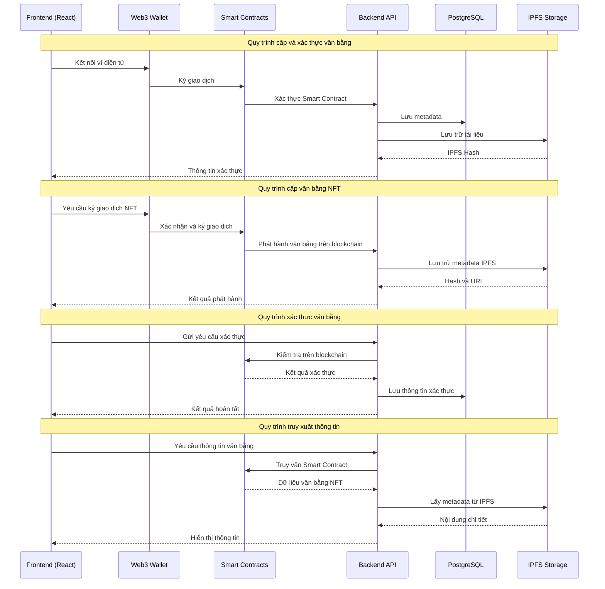

# 🌿 Giới thiệu về dự án GreenEduMap


> *"Xanh hơn mỗi ngày – Dữ liệu vì cộng đồng xanh 🌍"*

**GreenEduMap** là hệ thống bản đồ học tập – môi trường – năng lượng mở của đô thị thông minh.  
Dự án xây dựng **hệ sinh thái dữ liệu mở phục vụ đô thị học tập xanh**, kết nối ba lĩnh vực: **môi trường – năng lượng – giáo dục cộng đồng** để giúp người dân, trường học và chính quyền ra quyết định dựa trên dữ liệu thật.

✅ Trực quan hóa dữ liệu theo phường/xã  
✅ Cảnh báo và phân tích xu hướng môi trường  
✅ Đánh giá chỉ số giáo dục xanh (Green Skills)  
✅ Gợi ý hành động xanh theo từng khu vực  
✅ Tích hợp Linked Open Data (RDF/JSON-LD)

Tác giả: **DTU_GreenCity Team**

---

# 💫 Tại sao GreenEduMap quan trọng?

Mỗi đô thị đang phát triển phải đối mặt với ô nhiễm, nhiệt độ tăng, đô thị hóa nhanh và thiếu dữ liệu minh bạch.  
GreenEduMap ra đời để:

- 🌍 **Minh bạch hóa dữ liệu đô thị**  
    Gộp các dữ liệu rời rạc về môi trường, giáo dục, năng lượng thành một hệ thống duy nhất.

- 📊 **Phân tích thông minh bằng AI**  
    Xác định khu vực "báo động môi trường" hoặc “giảm chất lượng học tập” do ô nhiễm, thiếu cây xanh.

- 🧠 **Hỗ trợ chính quyền và trường học**  
    Quy hoạch cây xanh – lớp học xanh – năng lượng mặt trời dựa trên dữ liệu thật.

- 🔥 **Theo dõi dữ liệu thời gian thực**  
    AQI, PM2.5, nhiệt độ bề mặt, năng lượng mặt trời, thống kê giáo dục.

- 🤝 **Kết nối cộng đồng – hành động xanh**  
    Doanh nghiệp, người dân, trường học có thể đề xuất sáng kiến xanh, thực hiện chiến dịch cộng đồng.

---

# ✅ Mục tiêu dự án

Theo tài liệu dự án hiện có :contentReference[oaicite:1]{index=1}:

## 🎯 Mục tiêu tổng thể

Xây dựng **bản đồ tri thức đô thị xanh**, nơi dữ liệu môi trường – giáo dục – năng lượng được kết nối, phân tích và phục vụ cộng đồng.

## � Mục tiêu theo đối tượng

✔ **Người dân**  
- Xem bản đồ chất lượng sống  
- Hiểu tác động của môi trường lên sức khỏe và học tập  
- Nhận gợi ý hành động xanh (trồng cây, tiết kiệm năng lượng, tái chế)

✔ **Trường học & giáo viên**  
- Tích hợp dữ liệu môi trường thật vào bài giảng  
- Tổ chức khóa học “Green Skills”  
- Đánh giá mức độ xanh của trường

✔ **Chính quyền đô thị**  
- Ra quyết định quy hoạch cây xanh, năng lượng, cơ sở giáo dục  
- Theo dõi khu vực ô nhiễm và xu hướng thay đổi  
- Ưu tiên ngân sách cho địa bàn cần cải thiện

✔ **Doanh nghiệp xã hội – CSR**  
- Xác định khu vực nên tài trợ hoặc phát triển năng lượng tái tạo  
- Công khai hiệu quả các chiến dịch bảo vệ môi trường

---

# 🔍 Các tính năng chính

## 🗺 1. Bản đồ môi trường
- AQI, PM2.5, PM10, O3, NO2 theo từng phường/xã
- Nhiệt độ bề mặt từ vệ tinh Sentinel/Copernicus
- Lớp phủ cây xanh → phát hiện vùng “nóng đô thị”
- Chỉ số tiềm năng năng lượng mặt trời

## � 2. Bản đồ giáo dục xanh
- Trường học, hoạt động xanh, số khóa học “Green Skills”
- Xếp hạng trường theo chỉ số xanh
- Phân bố chương trình giáo dục bền vững

## 🧠 3. AI phân tích & dự báo
- Phân tích tương quan: **Môi trường ↔ Giáo dục**
- Clustering (K-Means) phân loại: **Xanh – Vàng – Đỏ**
- Dự báo xu hướng môi trường

## 🚀 4. AI Recommender
- Trồng bao nhiêu cây để giảm nhiệt độ & ô nhiễm?
- Khu vực nào cần mở khóa học xanh ngay?
- Nơi nào phù hợp để lắp pin mặt trời?
- Ưu tiên hành động theo tác động – chi phí – dân số

---

# 🧱 Kiến trúc hệ thống

```text
[OpenAQ / OpenWeather / Sentinel / Open Data Giáo dục]
│
▼
ETL Pipeline (Airflow)
- Collector API
- Làm sạch dữ liệu
- Chuyển đổi GeoJSON/CSV/Raster
│
▼
PostgreSQL + PostGIS + Tileserver
+ RDF/JSON-LD + DCAT
│
▼
FastAPI Backend
/env /edu /ml /recommend /lod
│
▼
Vue3 + MapboxGL/CesiumJS

Bản đồ 3D

Dashboard

Time series chart
```

---

# 🧩 Thành phần dữ liệu (Layers)


Theo file mô tả dự án :contentReference[oaicite:2]{index=2}:

### ✅ Environmental Layer
- AQI, PM2.5, PM10, tiếng ồn, cây xanh
- Nguồn: OpenAQ, OpenWeather, Copernicus, Sentinel

### ✅ Educational Layer
- Trường học, kỹ năng xanh, hoạt động cộng đồng
- Nguồn: data.moet.gov.vn, open data CSV

### ✅ Energy Layer
- Năng lượng mặt trời / gió
- Hiển thị heatmap vùng tiềm năng

### ✅ AI Behavior Layer
- Tương quan dữ liệu
- Gợi ý hành động xanh

### ✅ LOD Layer
- RDF + JSON-LD
- SPARQL endpoint
- Kết nối ChatGov AI / City Open Data

---

## 📌 Lợi ích mang lại

✅ Minh bạch dữ liệu môi trường – giáo dục  
✅ Công cụ ra quyết định cho chính quyền  
✅ Tăng nhận thức cộng đồng  
✅ Thúc đẩy giáo dục môi trường  
✅ Hỗ trợ nghiên cứu học thuật  
✅ Khuyến khích doanh nghiệp xanh đầu tư đúng điểm

---

## 🌏 Đối tượng hướng đến

- Người dân
- Chính quyền đô thị
- Trường học – giáo viên
- Nhà nghiên cứu & chuyên gia
- Doanh nghiệp năng lượng & CSR
- Tổ chức môi trường

---

## ✅ Một vài use-case thực tế

| Tình huống | GreenEduMap hỗ trợ |
|------------|--------------------|
| Khu vực đông dân, nóng đô thị | Gợi ý trồng cây bóng mát → giảm 2–4°C |
| Trường học thiếu chương trình xanh | Đề xuất mở lớp Green Skills |
| Doanh nghiệp CSR tìm nơi tài trợ | Chỉ ra phường nguy cơ cao, ít cây xanh |
| Chính quyền muốn đo hiệu quả trồng cây | Dashboard so sánh trước & sau 6 tháng |

---

## 🏗 Cấu trúc dự án

```text
greenedumap/
├─ backend/
│  ├─ app/
│  │  ├─ api/
│  │  ├─ ml/
│  │  ├─ models/
│  │  └─ services/
│  └─ requirements.txt
├─ frontend/
│  ├─ src/
│  └─ public/
├─ data/
│  ├─ geojson/
│  ├─ sentinel/
│  └─ openaq/
├─ docs/
│  ├─ api.md
│  └─ setup.md
└─ assets/
     └─ images/
```
---
## 📚 Hướng dẫn cài đặt
### ✅ Yêu cầu hệ thống

Node.js ≥ 16

Python ≥ 3.9

PostgreSQL + PostGIS

Docker & Docker Compose
---
### ✅ Chạy Backend
```bash
cd backend
pip install -r requirements.txt
uvicorn app.main:app --reload
```
---
### ✅ Chạy Frontend

```bash
cd frontend
npm install
npm run dev

```
---
### ✅ Docker
```bash
docker-compose up -d
```
---
### 🔌 API Endpoints
```http
GET /env/summary
GET /edu/schools
GET /ml/cluster
GET /ml/corr
POST /recommend
```
---
### 📑 Tài liệu chi tiết

API Docs: docs/api.md

Setup Guide: docs/setup.md

Data Dictionary: docs/data.md (dự kiến)
---
### 🤝 Đóng góp

Fork dự án

Tạo branch mới (feature/my-feature)

Commit (git commit -m "add feature")

Tạo Pull Request
---
### 🐛 Báo lỗi

Mô tả lỗi, bước tái hiện, ảnh chụp màn hình

Gửi vào mục Issues khi public repo
---
### 📝 License

(Thêm khi mở source)
---
## "Xanh hơn – Thông minh hơn – Dữ liệu mở vì cộng đồng 🌱" sửa file này theo nội dung này vẫn giữ nguyên cấu trúc nha

Ba nhóm đối tượng chính:

| � Người học | � Cơ sở đào tạo | 💼 Nhà tuyển dụng |
|----------------|-------------|-------------------|
| Quản lý hồ sơ học tập trọn đời | Số hóa quy trình cấp văn bằng | Xác thực văn bằng nhanh chóng |

---

## 🏗️ Kiến trúc hệ thống


| Tầng | Công nghệ chính | Vai trò | Điểm nổi bật |
|-------|-------------------|------|-----------|
| **Blockchain** | Ethereum, Smart Contracts | Lưu trữ và xác thực văn bằng | Bất biến, minh bạch |
| **Backend** | Node.js, Express | API và xử lý nghiệp vụ | Khả năng mở rộng cao |
| **Frontend** | React, Web3.js | Giao diện người dùng | UX thân thiện, tích hợp ví điện tử |
| **Storage** | IPFS, MongoDB | Lưu trữ metadata và tài liệu | Phi tập trung, bảo mật |
| **Smart Contracts** | Solidity + OpenZeppelin | Quản lý văn bằng NFT | Tính bất biến, tự động hóa |
| **SSI Layer** | DIDs + Verifiable Credentials | Quản lý định danh số | Chủ quyền dữ liệu |
| **API Gateway** | Express + GraphQL | Tích hợp bên thứ ba | Dễ dàng mở rộng |
| **Database** | PostgreSQL | Dữ liệu quan hệ, cache | Hiệu năng cao, bảo mật |
| **Security** | JWT, OAuth2 | Xác thực, phân quyền | Đa tầng bảo mật |
| **Analytics** | Elastic Stack | Phân tích, báo cáo | Theo dõi thời gian thực |

---

## 🔄 Luồng xử lý



### Giải thích các luồng chính:

1. **Cấp phát văn bằng**: Smart Contract tự động hóa quy trình, đảm bảo tính minh bạch.
2. **Xác thực văn bằng**: Kiểm tra tức thì trên blockchain, không thể giả mạo.
3. **Lưu trữ phi tập trung**: Metadata được lưu trên IPFS, đảm bảo tính bền vững.
4. **Truy xuất thông tin**: Dễ dàng tra cứu và xác minh thông tin văn bằng.

## ⚙️ Yêu cầu hệ thống
| Software     | Minimum Version       |
| ------------ | -------------------- |
| **Node.js**  | >= 16.0.0           |
| **Truffle**  | >= 5.0.0            |
| **Web3.js**  | >= 1.8.0            |
| **React**    | >= 18.0.0           |
| **MetaMask** | Phiên bản mới nhất  |
| **IPFS**     | >= 0.12.0           |
| **Vite** | 6.2.4 |

## 🚀 Hướng dẫn cài đặt

### 🌐 Triển khai hệ thống

```bash
# 1. Clone mã nguồn
git clone https://github.com/EduTraceBridge/platform.git
cd platform

# 2. Cài đặt dependencies
npm install

# 3. Biên dịch Smart Contracts
truffle compile

# 4. Khởi động blockchain local
ganache-cli

# 5. Triển khai Smart Contracts
truffle migrate

# 2. Create config file
cp .env.example .env
# ✏️ Fill in Database, RPC endpoints, Pinata API key

# 3. Build & Deploy
./scripts/deploy-ecs.sh

```

### 💻 Local Development

#### Backend Setup
```bash
composer i 
npm i
php artisan migrate
php artisan db:seed
npm run watch
php artisan server
```


### Demo Accounts
You can use the following accounts for demo:

**ADMIN :**

- Email: admin@gmail.com
- Password: 123456

**STUDENT :**

***Account 1***
- Email: anh.nm220001@dtu.edu.vn
- Password: 123456

***Account 2***
- Email: binh.tv220002@sis.hust.edu.vn
- Password: 123456

**SCHOOL:**

***Account 1***
- Email: admin@dtu.edu.vn
- Password: 123456

***Account 2***
- Email: admin@uet.vnu.edu.vn
- Password: 123456

**LECTURER:**

***Account 1***
- Email: nguyenquoclong@dtu.edu.vn
- Password: 123456


***Account 2***
- Email: lehoangnam@hust.edu.vn
- Password: 123456

**BUSINESS:**

***Account 1***
- Email: hr@fpt.com.vn
- Password: 123456

***Account 2***
- Email: tuyen.dung@viettel.com.vn
- Password: 123456

## 🧑‍💻 Contribution

```bash
# 1. Fork the repository and clone to local
git clone git@gitlab.com:ThanhTruong2311/blockchain_dtudz.git
cd blockchain_dtudz

# 2. Create a new branch for the feature
git checkout -b feat/my-awesome-feature

# 3. Commit following Conventional Commits
git add .
git commit -m "feat: add new awesome feature"

# 4. Push and create a Pull Request
git push origin feat/my-awesome-feature
# 🔀 Create a Pull Request on GitLab
```

### 📋 Contribution Guidelines
- ✅ Follow [Conventional Commits](https://www.conventionalcommits.org/)
- ✅ Write tests for new code
- ✅ Ensure code passes all CI/CD checks
- ✅ Update documentation if needed


## 👥 Team Members
| Role      | Name                    | Email                                                                 |
| --------- | ----------------------- | --------------------------------------------------------------------- |
| Leader    | **Nguyễn Quốc Long**     | [quoclongdng@gmail.com](mailto:quoclongdng@gmail.com)                 |
| Developer | **Trần Xuân Trường**      | [xuantruong081205@gmail.com](mailto:xuantruong081205@gmail.com) |
| Developer | **Hồ Dương Quốc Huy**          | [huyho2782005@gmail.com](mailto:huyho2782005@gmail.com)                     |
| Developer | **Lê Tuấn Minh**      | [llttminh@gmail.com](mailto:llttminh@gmail.com)             |


## 📜 License
Released under the MIT License – see LICENSE file for details.

© 2025 EduBridgeTrace – Build trust, unlock opportunity.


