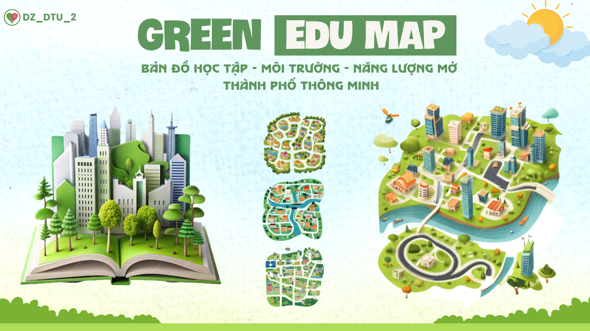
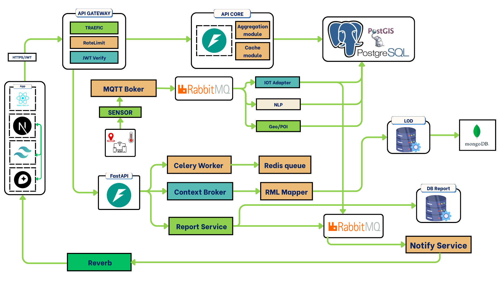

# 🌿 GreenEduMap - Dữ liệu mở dẫn lối đô thị xanh

<div align="center">

[](LICENSE)

**🤝 [Đóng Góp](CONTRIBUTING.md)** • **📜 [Changelog](CHANGELOG.md)**

</div>

<div align="center">

[](https://github.com/MNM-DTU-DZ2/GreenEduMap-DTUDZ) [](docs/index.md)

</div>



> _"Xanh hơn mỗi ngày – Dữ liệu vì cộng đồng xanh 🌍"_

## 📖 Tổng Quan

**GreenEduMap** là một dự án mã nguồn mở do đội **DTU-DZ_2** đến từ **Đại học Duy Tân** phát triển để tham gia cuộc thi **Olympic Tin học Sinh viên – Khối Mã nguồn mở 2025**. Dự án thuộc lĩnh vực đô thị thông minh xanh, với mục tiêu :

🤝 **Kết nối người dân – trường học – chính quyền** bằng bản đồ tri thức.
🔍 **Minh bạch hóa dữ liệu đô thị** theo từng khu vực để cộng đồng dễ tiếp cận.
🤖 **Tối ưu hóa quy trình ra quyết định bằng AI** giúp gợi ý hành động xanh phù hợp từng khu vực.
🎓 **Thúc đẩy giáo dục bền vững** và khuyến khích cộng đồng cùng đóng góp, mở rộng.

Dự án tập trung hình thành một nền tảng toàn diện kết hợp AI, GIS, OpenData và dashboard thời gian thực để tạo nên hệ sinh thái đô thị minh bạch, xanh và có khả năng mở rộng cho nhiều địa phương.

---

## 👥 Dự án này dành cho ai?


1. **Người dân** → xem chất lượng sống và nhận gợi ý hành động xanh, cung cấp thông tin môi trường .
2. **Chính quyền** → ra quyết định dựa trên dữ liệu, sử dụng dữ liệu để quản lý đô thị hiệu quả.
3. **Trường học** → triển khai giáo dục xanh (Green Skills), tích hợp dữ liệu vào giáo dục môi trường.
4. **Tổ chức môi trường** → sử dụng dữ liệu cho và giám sát, xây dựng chiến dịch truyền thông dựa trên dữ liệu thật.
5. **Nhà nghiên cứu** → truy cập dữ liệu mở chuẩn hóa để nghiên cứu và đổi mới, xây dựng mô hình AI/ML.
---

## ✨ Modules chính của GreenEduMap

### 1. 📱 Module tương tác người dân

🌍 Xem dữ liệu môi trường realtime (chất lượng không khí, nhiệt độ, cảnh báo ô nhiễm)

🏫 Tìm kiếm trường học xanh và khóa học bền vững (Green Skills)

📊 Theo dõi chất lượng sống theo từng khu vực

💡 Nhận gợi ý hành động xanh từ AI GreenBot

### 2. 🤖 Module phân tích AI & Dữ liệu

🧠 **AI GreenBot**: Phân tích tương quan môi trường ↔ giáo dục, phát hiện mẫu bất thường

📈 Clustering khu vực (Xanh – Vàng – Đỏ) dựa trên chỉ số môi trường

🔮 Dự báo xu hướng ô nhiễm và biến động mảng xanh

⭐ Đánh giá và gợi ý hành động xanh tự động cho từng khu vực

### 3. 🗺️ Module quản lý dữ liệu môi trường & giáo dục

🌡️ Thu thập và quản lý dữ liệu môi trường (OpenAQ, OpenWeather, Sentinel)

🏫 Quản lý trường học, khóa học xanh và tính toán Green Score

🗺️ Bản đồ 3D realtime hiển thị dữ liệu môi trường – giáo dục theo từng phường/xã

📊 Dashboard trực quan cho chính quyền và trường học

### 4. 📊 Module quản trị hệ thống & OpenData

📉 Dashboard tổng quan và báo cáo KPI cho cơ quan quản lý

🔗 API mở theo chuẩn NGSI-LD và Linked Open Data

📥 Export dữ liệu đa định dạng (JSON, CSV, GeoJSON, RDF)

⚙️ Phân quyền, quản lý người dùng và giám sát hệ thống

---

## 🧱 Kiến trúc hệ thống



### Thành phần và công nghệ sử dụng

| Thành phần         | Công nghệ sử dụng                                       |
| ------------------ | ------------------------------------------------------- |
| **Mobile App**     | React Native (iOS & Android)                            |
| **Web**  | Next.js 15                                              |
| **Backend Core**   | Laravel (PHP), Redis (Cache)                            |
| **AI Services**    | FastAPI (Python) cho NLP, Computer Vision, scikit-learn |
| **API Gateway**    | Traefik, Keycloak (Auth)                                |
| **Message Broker** | Apache Kafka, MQTT (EMQX/Mosquitto)                     |
| **Realtime**       | Reverb (WebSocket)                                      |
| **Database**       | PostgreSQL + PostGIS (GeoData), OpenSearch              |
| **Semantic**       | FiWARE Orion-LD, MongoDB                                |

---

## 🔗 Linked Open Data - NGSI-LD

GreenEduMap tuân thủ chuẩn **NGSI-LD** (ETSI GS CIM 009) nhằm chia sẻ dữ liệu đô thị xanh theo hướng Linked Open Data và tương thích với hệ sinh thái **FiWARE Orion-LD** đang được nhiều thành phố thông minh sử dụng.

### Vì sao NGSI-LD cho GreenEduMap?
- **Chuẩn quốc tế**: NGSI-LD bảo đảm dữ liệu môi trường – giáo dục tuân thủ đặc tả ETSI, dễ dàng kết nối với nền tảng Smart City khác.
- **Interoperability**: Entity có URI chuẩn (`urn:ngsi-ld:AirQuality:...`, `urn:ngsi-ld:School:...`) nên tích hợp song song với GIS, dashboard của địa phương.
- **Linked Data**: JSON-LD cho phép gắn ngữ nghĩa (SOSA/SSN, Smart Data Models) giúp AI phân tích quan hệ môi trường ↔ giáo dục.
- **Open Data**: API công khai phục vụ nhà nghiên cứu, startup xây ứng dụng xanh mà không cần phụ thuộc vào nền tảng độc quyền.

### API endpoints chính

```text
# Liệt kê entity Linked Data
GET    /api/ngsi-ld/v1/entities
GET    /api/ngsi-ld/v1/entities?type=AirQuality
GET    /api/ngsi-ld/v1/entities?type=School

# Chi tiết & truy vấn thời gian
GET    /api/ngsi-ld/v1/entities/{id}
GET    /api/ngsi-ld/v1/temporal/entities/{id}

# Ghi/đăng ký
POST   /api/ngsi-ld/v1/entities              (Content-Type: application/ld+json)
PATCH  /api/ngsi-ld/v1/entities/{id}/attrs
POST   /api/ngsi-ld/v1/subscriptions         (webhook khi AQI hoặc điểm xanh thay đổi)
```

### Smart Data Models tiêu biểu

- `AirQualityObservation` (FiWARE Smart Data Models): thuộc tính `aqi`, `pm25`, `observedAt`, `location` (GeoProperty - GeoJSON Point), `source`.
- `School`/`GreenSchool`: thuộc tính `greenScore`, `facilities`, `courseCatalog`, `address`, `status`.


> 📚 Chi tiết cấu trúc NGSI-LD và context JSON-LD được mô tả trong `PROJECT_WORK.md` và các tài liệu trong thư mục `docs/`.

---

## 🧩 Hướng Phát Triển

Dự án hướng tới xây dựng hệ sinh thái đô thị xanh thông minh, không chỉ dừng lại ở hiển thị dữ liệu mà còn mở rộng khả năng dự báo, tự động hóa và kết nối cộng đồng.

### 🌐 Mở rộng & Kết nối

- Triển khai đa đô thị: Mở rộng GreenEduMap cho nhiều thành phố, hỗ trợ đa ngôn ngữ
- Bản đồ 3D thời gian thực: Hiển thị lớp dữ liệu môi trường – giáo dục – năng lượng với vùng cảnh báo.
- Nền tảng cộng đồng xanh: Kết nối người dân – trường học – doanh nghiệp thông qua dữ liệu mở và hoạt động xanh.

### 🧠 Nâng cấp AI & Dữ liệu

- Dự báo xu hướng đô thị: Phân tích dữ liệu lịch sử để dự đoán ô nhiễm không khí, nhiệt độ và biến động mảng xanh.
- AI GreenBot nâng cao: Học từ dữ liệu người dùng đóng góp và cảm biến IoT môi trường.
- Phân tích hình ảnh vệ tinh: Tự động nhận diện thay đổi cây xanh, bê tông hóa từ ảnh Sentinel.

### 🔗 Dữ liệu mở & Minh bạch

- Chuẩn hóa dữ liệu mở: Áp dụng NGSI-LD, RDF/JSON-LD để chia sẻ dữ liệu môi trường và giáo dục.
- API mở: Cho phép sinh viên, nhà nghiên cứu và startup phát triển các ứng dụng xanh trên nền tảng.
- Quản lý chất lượng dữ liệu: Theo dõi nguồn gốc dữ liệu (data lineage) và độ tin cậy.

### 🌍 Tầm nhìn dài hạn

- Xây dựng bản sao số đô thị xanh 3D, mô phỏng môi trường – giáo dục – năng lượng, dự báo xu hướng và gợi ý giải pháp tối ưu.
- Kết nối người dân, trường học, doanh nghiệp và chính quyền trong một hệ sinh thái dữ liệu mở.
- Ứng dụng AI dự báo ô nhiễm, thay đổi cây xanh và năng lượng, giúp ra quyết định nhanh và bền vững.
- Triển khai GreenEduMap tại nhiều thành phố Đông Nam Á, chuẩn hóa dữ liệu theo NGSI-LD và Linked Open Data, trở thành trung tâm dữ liệu đô thị xanh mã nguồn mở hàng đầu khu vực.

---

## ⚖️ Quy Tắc Ứng Xử

Dự án này tuân theo bộ quy tắc ứng xử cho cộng đồng. Xem file [CODE_OF_CONDUCT.md](CODE_OF_CONDUCT.md) để biết thêm chi tiết về các quy tắc và hành vi được chấp nhận.

---

## 🚀 Cài Đặt Hệ Thống

### Yêu cầu hệ thống
- **Node.js** 18+ (Next.js web)
- **Python** 3.9+ (FastAPI services)
- **PHP** 8.2+ (Laravel backend)
- **PostgreSQL** 14+ + PostGIS extension
- **Docker & Docker Compose** (for containerized deployment)
- **Redis** 7+

### Cài đặt nhanh (Local Development)

```bash
# Clone repository
git clone https://github.com/MNM-DTU-DZ2/GreenEduMap-DTUDZ.git
cd GreenEduMap-DTUDZ

# Setup environment
cp .env.example .env
cp .env.local.example .env.local

# Docker Compose (recommended)
docker-compose -f infrastructure/docker/docker-compose.yml up -d

# Web App Setup
cd modules/web-app
npm install
npm run dev  # Runs on http://localhost:3000

# Backend Setup (if running locally)
cd backend
pip install -r requirements.txt
uvicorn main:app --reload

# Seed database
cd modules/web-app
npx prisma migrate dev
npx prisma db seed
```

### Verify Installation
```bash
# Check all services are running
curl http://localhost:3000          # Web app
curl http://localhost:8000          # API Gateway
curl http://localhost:5432          # PostgreSQL
curl http://localhost:6379          # Redis
```

Xem chi tiết tại `docs/guides/setup.md`

---

## 📁 Cấu trúc thư mục

```
GreenEduMap
├── backend/            # FastAPI, services, AI models
├── frontend/
├── app/
├── docker/             # Deployment stack
├── data/               # SQL seeds, GeoJSON, raster
├── docs/               # Documentation, diagrams
├── scripts/            # ETL, LOD exports
└── .github/workflows/  # CI/CD pipelines
```

---

## 🧪 Kiểm thử

```bash
cd backend
pytest -v --cov=app

cd frontend
npm run test
```

---

## 📄 Tài liệu liên quan

| File                          | Mô tả                  |
| ----------------------------- | ---------------------- |
| `docs/architecture.md`        | Kiến trúc chi tiết     |
| `docs/api_reference.md`       | API đầy đủ             |
| `docs/open_data_standards.md` | NGSI-LD, SOSA/SSN, LOD |
| `CONTRIBUTING.md`             | Quy tắc đóng góp       |

---

## 🤝 Đóng Góp Cho Dự Án

Dự án này là mã nguồn mở, được phát triển bởi đội **DTU-DZ_2** đến từ **Đại học Duy Tân** để tham gia cuộc thi **Olympic Tin học Sinh viên – Khối Mã nguồn mở năm 2025** nên rất hoan nghênh cộng đồng tham gia đóng góp!

### 🌱 Quy Trình Đóng Góp

#### 1. Fork Repository

```bash
# Fork repository trên GitHub
# Clone về máy local
git clone https://github.com/MNM-DTU-DZ2/GreenEduMap-DTUDZ.git
cd GreenEduMap-DTUDZ
```

#### 2. Tạo Branch Mới

```bash
# Tạo và chuyển sang branch mới
git checkout -b feat/<new-feature>

# Ví dụ
git checkout -b feat/air-quality-api
```

#### 3. Commit Thay Đổi

```bash
# Thêm file đã thay đổi
git add .

# Commit với message rõ ràng
git commit -m "feat: add air quality API module"
```

#### 4. Push Branch

```bash
# Push lên repository của bạn
git push -u origin feat/<new-feature>
```

#### 5. Tạo Pull Request

- Truy cập repository gốc tại GitHub
- Chọn "New Pull Request"
- Chọn branch của bạn để merge
- Điền thông tin mô tả chi tiết

### 📝 Issues

Báo cáo lỗi và đề xuất tính năng mới tại [GitHub Issues](https://github.com/MNM-DTU-DZ2/GreenEduMap-DTUDZ/issues)

Xem thêm hướng dẫn đóng góp tại [CONTRIBUTING.md](CONTRIBUTING.md)

---

## 👥 Người Hướng Dẫn

| 👨‍🏫 Vai Trò | 📧 Thông Tin |
| ----------- | ------------ |
| **Giảng Viên** | **Nguyễn Quốc Long**<br>Email: quoclongdng@gmail.com |

### 📞 Liên hệ Team DTU-DZ2

Nếu cần trao đổi gì thêm, vui lòng liên hệ:

- **Trần Xuân Trường**: xuantruong081205@gmail.com
- **Hồ Dương Quốc Huy**: huyho2782005@gmail.com
- **Lê Tuấn Minh**: llttminh@gmail.com

---

## 📜 License

Dự án này được phân phối dưới [GNU General Public License v3.0](LICENSE). Xem file `LICENSE` để biết thêm chi tiết.

---

© 2025 **GreenEduMap** - Dữ liệu mở dẫn lối đô thị xanh 🌱  

