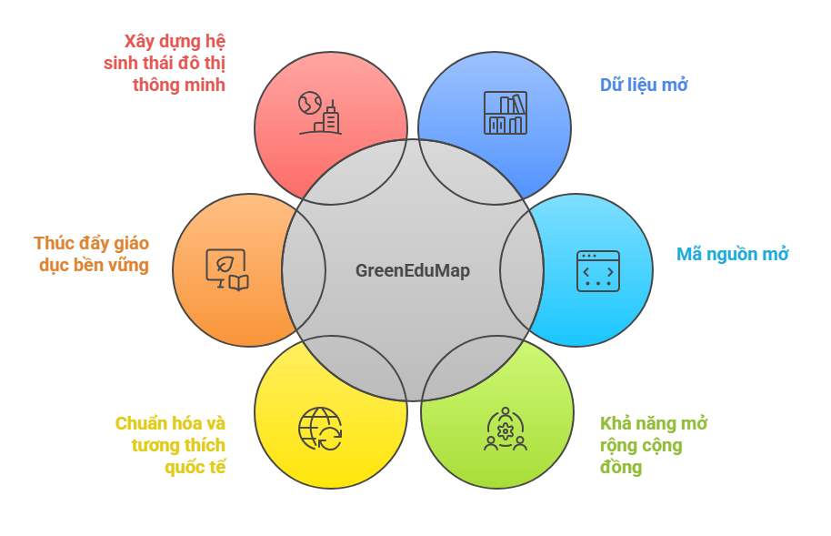
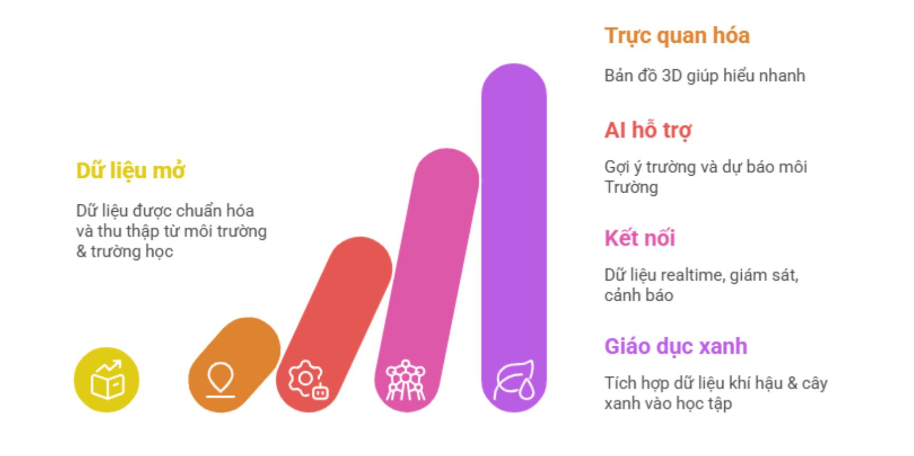

# 🌿 Giới thiệu về dự án GreenEduMap


> *"Xanh hơn mỗi ngày – Dữ liệu vì cộng đồng xanh 🌍"*

## 📖 Tổng Quan


**GreenEduMap** là một dự án mã nguồn mở được phát triển bởi đội **DTU-DZ_2** Đến từ **Đại học Duy Tân** nhằm tham gia cuộc thi **Olympic Tin học Sinh viên – Khối Mã nguồn mở năm 2025**. Dự án tập trung xây dựng trên nền tảng **bản đồ tri thức đô thị xanh**, giúp kết nối **người dân – trường học – chính quyền** thông qua dữ liệu mở và công nghệ hiện đại.

GreenEduMap hướng đến việc số hóa và trực quan hóa các dữ liệu quan trọng như **môi trường, giáo dục và năng lượng** trên **bản đồ 3D thời gian thực**, từ đó hỗ trợ ra quyết định thông minh và khuyến khích cộng đồng tham gia các hành động bền vững.

---

## 💡 Tại sao lại có dự án này?

Chúng ta đều thấy các đô thị đang phát triển nhanh chóng, và các vấn đề như ô nhiễm không khí, hiệu ứng đảo nhiệt đô thị, thiếu cây xanh hay chất lượng giáo dục môi trường đang trở nên nghiêm trọng hơn. Tuy nhiên:

- Dữ liệu môi trường, giáo dục và năng lượng tồn tại rời rạc ở nhiều nguồn khác nhau, khó truy cập và thiếu chuẩn hóa.

- Chính quyền thiếu công cụ phân tích tổng hợp để ra quyết định quy hoạch cây xanh, năng lượng tái tạo hay giáo dục bền vững dựa trên dữ liệu khoa học.

- Người dân và trường học không có nguồn thông tin đáng tin cậy, trực quan về chất lượng môi trường và các hoạt động xanh quanh khu vực mình.

GreenEduMap ra đời để giải quyết những vấn đề đó, hướng tới một đô thị minh bạch hơn, thông minh hơn và bền vững hơn thông qua dữ liệu mở và giáo dục xanh.

---

## 👥 Dự án này dành cho ai?


1. **Người dân** → xem chất lượng sống và nhận gợi ý hành động xanh, cung cấp thông tin môi trường cho lối sống xanh.

2. **Chính quyền** → ra quyết định dựa trên dữ liệu, sử dụng dữ liệu để quản lý đô thị hiệu quả.

3. **Trường học** → triển khai giáo dục xanh (Green Skills), tích hợp dữ liệu vào giáo dục môi trường.

4. **Nhà nghiên cứu** → truy cập dữ liệu mở chuẩn hóa để nghiên cứu và đổi mới, xây dựng mô hình AI/ML.

5. **Doanh nghiệp xanh** → tìm vị trí thích hợp để đầu tư CSR hoặc năng lượng tái tạo, sử dụng dữ liệu cho các sáng kiến bền vững.

6. **Tổ chức môi trường** → sử dụng dữ liệu cho vận động và giám sát, xây dựng chiến dịch truyền thông dựa trên dữ liệu thật.

---

## ✨ Có gì đặc biệt?


- **AI GreenBot**: KTự động phân tích dữ liệu để đọc hiểu dữ liệu môi trường – giáo dục, phát hiện mẫu bất thường và gợi ý các hành động xanh cụ thể cho từng khu vực.

- **Bản đồ Realtime**: Người dùng có thể xem nhanh bức tranh “sức khỏe đô thị” trên bản đồ 3D, cập nhật theo thời gian thực với nhiều lớp dữ liệu 

- **Đa nền tảng**: Web Dashboard cho chính quyền/trường học và Mobile App cho người dân.

- **Dữ liệu mở & tương thích quốc tế**: Dữ liệu giúp dễ dàng chia sẻ, tái sử dụng và phục vụ nghiên cứu.


---

## 🎯  Mục tiêu dự án

### 🎯 Mục tiêu tổng thể
Xây dựng bản đồ tri thức đô thị xanh nơi dữ liệu → AI → hành động xanh → cải thiện chất lượng sống.

### 🎯 Mục tiêu cụ thể
- Tăng tính minh bạch dữ liệu đô thị — công khai dữ liệu môi trường, giáo dục, năng lượng theo từng khu vực.
- Xây dựng hệ thống dữ liệu mở theo chuẩn NGSI-LD và Linked Open Data.
- Tối ưu hóa quy trình ra quyết định bằng AI (phân tích tương quan, gợi ý hành động xanh).
- Thúc đẩy giáo dục bền vững (Green Skills) — cung cấp dữ liệu môi trường thật và hệ sinh thái khóa học xanh.
- Khuyến khích cộng đồng đóng góp và mở rộng — mã nguồn mở (GPL v3), API mở, hỗ trợ triển khai đa thành phố.
- Hỗ trợ nghiên cứu và phát triển giải pháp thông minh cho đô thị.
- Xây dựng hệ sinh thái đô thị thông minh, hỗ trợ mô phỏng và dự báo.

---

## 💫  Thách thức mà dự án hướng tới?

- Dữ liệu đô thị hiện tại rời rạc, khó truy cập, thiếu chuẩn hóa.
- Chính quyền thiếu công cụ phân tích nhiệt độ – ô nhiễm – năng lượng – giáo dục theo từng phường/xã.
- Trường học cần dữ liệu thật để dạy kỹ năng xanh.
- Người dân không có nguồn thông tin đáng tin cậy về chất lượng sống quanh mình.
- Cộng đồng thiếu hành vi xanh vì không biết bắt đầu từ đâu.

---

## 🛠️  Giải pháp của dự án

- Bản đồ 3D tương tác hiển thị dữ liệu môi trường, giáo dục, năng lượng theo từng phường/xã với các lớp dữ liệu đa tầng.

- ETL Pipeline tích hợp và chuẩn hóa dữ liệu từ nhiều nguồn mở (OpenAQ, OpenWeather, Sentinel, OpenStreetMap).

- AI phân tích tương quan môi trường ↔ giáo dục, clustering khu vực (Xanh – Vàng – Đỏ), và gợi ý hành động xanh dựa trên dữ liệu.

- Dashboard trực quan cho từng đối tượng: chính quyền (phân tích KPI, điểm nóng), trường học (quản lý khóa học xanh), người dân (theo dõi chất lượng sống).

- Hệ thống giáo dục bền vững (Green Skills) — quản lý khóa học, hoạt động xanh, và đánh giá chỉ số "Trường học xanh".

- API mở theo chuẩn NGSI-LD và Linked Open Data (RDF/JSON-LD) để tích hợp với hệ thống thành phố và bên thứ ba.

- Digital Twin đô thị xanh — tạo bản sao số cho từng phường/xã với dữ liệu real-time, hỗ trợ mô phỏng và dự báo xu hướng.

- Mã nguồn mở (GPL v3) với quy trình đóng góp rõ ràng, hỗ trợ triển khai đa thành phố và mở rộng cộng đồng.

---

## 👥  Vai trò & phân quyền

| Vai trò | Khả năng | Màn hình |
| --- | --- | --- |
| 👨‍💻 Admin | Quản lý dữ liệu, phân quyền, cấu hình AI | Dashboard, Wards, Users, Logs |
| 🧑‍🏫 School | Khóa học xanh, học viên, báo cáo | Courses, Students, Activities |
| 👩‍💼 Citizen | Bản đồ, phản hồi, nhận gợi ý AI | Map, Feedback, Actions, Stats |

---

## 🧱  Kiến trúc hệ thống


### Thành phần và công nghệ sử dụng

| Thành phần | Công nghệ sử dụng |
|-----------|-------------------|
| **Mobile App** | React Native (iOS & Android) |
| **Web Dashboard** | Next.js 15 |
| **Backend Core** | Laravel (PHP), Redis (Cache) |
| **AI Services** | FastAPI (Python) cho NLP, Computer Vision, scikit-learn |
| **API Gateway** | Traefik, Keycloak (Auth) |
| **Message Broker** | Apache Kafka, MQTT (EMQX/Mosquitto) |
| **Realtime** | Reverb (WebSocket) |
| **Database** | PostgreSQL + PostGIS (GeoData), OpenSearch |
| **Semantic** | FiWARE Orion-LD, MongoDB |


---

## 🔄  Cách hoạt động

Quy trình đơn giản như sau:

**Người dùng** 📱 → Xem bản đồ 3D, dashboard, hoặc gửi phản hồi qua App.

**Hệ thống thu thập dữ liệu** 🌐 → ETL tự động lấy dữ liệu từ OpenAQ, OpenWeather, Sentinel, OpenStreetMap → Làm sạch & chuẩn hóa

**AI phân tích & xử lý** 🤖 → Phân tích tương quan môi trường ↔ giáo dục, clustering khu vực, gợi ý hành động xanh → Cập nhật NGSI-LD Entities.

**Hiển thị** 🗺️ → Bản đồ 3D realtime, dashboard, thống kê → Người dùng nhận gợi ý xanh

---

## 🧩  Hướng Phát Triển 

 Dự án hướng tới xây dựng hệ sinh thái đô thị xanh thông minh, không chỉ dừng lại ở hiển thị dữ liệu mà còn mở rộng khả năng dự báo, tự động hóa và kết nối cộng đồng.

### 🌐 Mở rộng & Kết nối
- Triển khai đa đô thị: Mở rộng GreenEduMap cho nhiều thành phố, hỗ trợ đa ngôn ngữ
- Bản đồ 3D thời gian thực: Hiển thị lớp dữ liệu môi trường – giáo dục – năng lượng với vùng cảnh báo “điểm nóng”.
- Nền tảng cộng đồng xanh: Kết nối người dân – trường học – doanh nghiệp thông qua dữ liệu mở và hoạt động xanh.

### 🧠 Nâng cấp AI & Dữ liệu
- Dự báo xu hướng đô thị: Phân tích dữ liệu lịch sử để dự đoán ô nhiễm không khí, nhiệt độ và biến động mảng xanh.
- AI GreenBot nâng cao: Học từ dữ liệu người dùng đóng góp và cảm biến IoT môi trường.
- Phân tích hình ảnh vệ tinh: Tự động nhận diện thay đổi cây xanh, bê tông hóa từ ảnh Sentinel.

### 🔗 Dữ liệu mở & Minh bạch
- Chuẩn hóa dữ liệu mở: Áp dụng NGSI-LD, RDF/JSON-LD để chia sẻ dữ liệu môi trường và giáo dục.
- API mở: Cho phép sinh viên, nhà nghiên cứu và startup phát triển các ứng dụng xanh trên nền tảng.
- Quản lý chất lượng dữ liệu: Theo dõi nguồn gốc dữ liệu (data lineage) và độ tin cậy.

### 🌍 Tầm nhìn dài hạn 
- Xây dựng bản sao số đô thị xanh 3D, mô phỏng môi trường – giáo dục – năng lượng, dự báo xu hướng và gợi ý giải pháp tối ưu.
- Kết nối người dân, trường học, doanh nghiệp và chính quyền trong một hệ sinh thái dữ liệu mở.
- Ứng dụng AI dự báo ô nhiễm, thay đổi cây xanh và năng lượng, giúp ra quyết định nhanh và bền vững.
- Triển khai GreenEduMap tại nhiều thành phố Đông Nam Á, chuẩn hóa dữ liệu theo NGSI-LD và Linked Open Data, trở thành trung tâm dữ liệu đô thị xanh mã nguồn mở hàng đầu khu vực.

## 🌿  Lợi ích mang lại

### 🌍 Minh bạch dữ liệu đô thị
Dữ liệu phân tán → chuẩn hóa → hiển thị trực quan.

### 🏛 Hỗ trợ quyết định cho chính quyền
- Xác định điểm nóng đô thị
- Quy hoạch cây xanh / năng lượng tái tạo
- Ưu tiên ngân sách theo mức độ rủi ro

### 🎓 Thúc đẩy giáo dục xanh
- Khóa học Green Skills
- Hoạt động dựa trên dữ liệu thật
- Chỉ số "Trường học xanh"

### 👨‍👩‍👧 Người dân chủ động hành động xanh
- Nhận cảnh báo môi trường
- Gợi ý hành động theo khu vực
- Theo dõi chất lượng sống quanh mình

---

## 📁  Cấu trúc thư mục

```
GreenEduMap
├── backend/            # FastAPI, services, AI models
├── frontend/           
├── app/           
├── docker/             # Deployment stack
├── data/               # SQL seeds, GeoJSON, raster
├── docs/               # Documentation, diagrams
├── scripts/            # ETL, LOD exports
└── .github/workflows/  # CI/CD pipelines
```

---

## 🗂  Dữ liệu & mô hình

- `users` – Admin, School, Citizen
- `schools`, `courses`, `enrollments`
- `air_quality`, `weather`, `energy_data`
- `citizen_feedback`
- `ai_analysis`, `ai_clusters`

**Bảng GIS:** `geometry(Point, 4326)` + GiST Index  
**LOD Export:** JSON-LD / Turtle / RDF-XML, FiWARE Smart Data Models, W3C SOSA/SSN

---

## 🧪  Kiểm thử

```bash
cd backend
pytest -v --cov=app

cd frontend
npm run test
```

---

## 📄  Tài liệu liên quan

| File | Mô tả |
| --- | --- |
| `docs/architecture.md` | Kiến trúc chi tiết |
| `docs/api_reference.md` | API đầy đủ |
| `docs/open_data_standards.md` | NGSI-LD, SOSA/SSN, LOD |
| `CONTRIBUTING.md` | Quy tắc đóng góp |

---

## 🤝  Đóng góp

1. Fork repo
2. Tạo branch `git checkout -b feature/my-feature`
3. Viết test + cập nhật docs
4. `git commit -m "feat: add xyz"`
5. `git push` & mở Pull Request

Tuân thủ Conventional Commits & Code Style của dự án.

---

## 👥  Team Members

| Vai trò | Thành viên | Email |
| --- | --- | --- |
| Leader | Nguyễn Quốc Long | quoclongdng@gmail.com |
| Developer | Trần Xuân Trường | xuantruong081205@gmail.com |
| Developer | Hồ Dương Quốc Huy | huyho2782005@gmail.com |
| Developer | Lê Tuấn Minh | llttminh@gmail.com |

---

## 📜  License

Dự án này được phân phối dưới [GNU General Public License v3.0](LICENSE). Xem file `LICENSE` để biết thêm chi tiết.

---

🎉 **GreenEduMap – Built for OLP 2025 Smart City Challenge**  
🌿 *Empowering sustainable cities through open data and education.*
