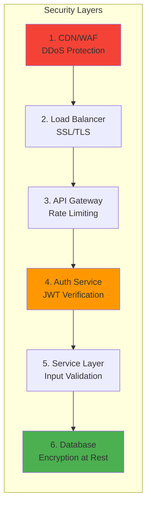

```mermaid
graph TB
    subgraph "Client Layer"
        WEB[Web Browser]
        MOBILE[Mobile App]
        ADMIN[Admin Portal]
        DEV[Developer Portal]
    end

    subgraph "CDN & Load Balancer"
        CDN[Cloudflare CDN]
        LB[Nginx Load Balancer]
    end

    subgraph "Application Layer"
        NEXT[Next.js Frontend<br/>:3000]
        GATEWAY[API Gateway<br/>:8000]
    end

    subgraph "Service Mesh"
        direction TB
        
        subgraph "Core Services"
            S1[Auth :8001]
            S2[User :8002]
            S3[Rescue :8003]
            S4[Resource :8004]
            S5[Distribution :8005]
        end
        
        subgraph "Smart Services"
            S6[AI :8006]
            S7[Environment :8007]
            S8[Education :8008]
            S9[Map :8009]
        end
        
        subgraph "Infrastructure"
            S10[Blockchain :8010]
            S11[Notification :8011]
            S12[Storage :8012]
            S13[Cache :8013]
        end
        
        subgraph "OpenData"
            S14[Catalog :8014]
            S15[Export :8015]
            S16[LOD :8016]
            S17[Webhook :8017]
        end
    end

    subgraph "Data Layer"
        PG[(PostgreSQL<br/>:5432)]
        MG[(MongoDB<br/>:27017)]
        RD[(Redis<br/>:6379)]
        FW[(FiWARE<br/>:1026)]
    end

    subgraph "External Services"
        OPENAQ[OpenAQ API]
        WEATHER[OpenWeather API]
        SENTINEL[Sentinel API]
    end

    WEB --> CDN
    MOBILE --> CDN
    ADMIN --> CDN
    DEV --> CDN
    
    CDN --> LB
    LB --> NEXT
    LB --> GATEWAY
    
    GATEWAY --> S1
    GATEWAY --> S2
    GATEWAY --> S3
    GATEWAY --> S14
    GATEWAY --> S15
    GATEWAY --> S16
    
    S1 --> PG
    S2 --> PG
    S3 --> PG
    S6 --> PG
    S7 --> PG
    S7 --> OPENAQ
    S7 --> WEATHER
    S8 --> PG
    S9 --> PG
    
    S10 --> MG
    S11 --> RD
    S13 --> RD
    S14 --> PG
    S15 --> PG
    S16 --> FW
    S17 --> RD
    
    S7 --> FW
    S8 --> FW

    style WEB fill:#4CAF50
    style DEV fill:#4CAF50
    style GATEWAY fill:#2196F3
    style S14 fill:#00BCD4
    style S16 fill:#FF9800
    style PG fill:#336791
    style FW fill:#1976D2
```

<!--GreenEduMap-DTUDZ - Open Data Platform for Green Urban Development
Copyright (C) 2025 DTU-DZ2 Team

This program is free software: you can redistribute it and/or modify
it under the terms of the GNU General Public License as published by
the Free Software Foundation, either version 3 of the License, or
(at your option) any later version.

This program is distributed in the hope that it will be useful,
but WITHOUT ANY WARRANTY; without even the implied warranty of
MERCHANTABILITY or FITNESS FOR A PARTICULAR PURPOSE. See the
GNU General Public License for more details.

You should have received a copy of the GNU General Public License
along with this program. If not, see <https://www.gnu.org/licenses/>.-->
# 🌐 GreenEduMap - OpenData-First Architecture

> **Ứng dụng dữ liệu mở liên kết phục vụ chuyển đổi số**  
> OLP 2025 - Smart City Challenge

---

## 🎯 Nguyên Tắc Thiết Kế

### OpenData Core Principles
1. ✅ **Open by Default** - Mọi dữ liệu public trừ khi có lý do bảo mật
2. ✅ **API-First** - Mọi service đều expose REST API chuẩn
3. ✅ **Linked Data** - Tất cả entities đều có URI và linked
4. ✅ **Machine-Readable** - JSON, CSV, GeoJSON, RDF
5. ✅ **Community-Extensible** - Plugin architecture cho developers

---

## 🗄️ Database Schema - OpenData Design

### Core Design Principles

```sql
-- Every table has:
-- 1. UUID for public API (not sequential ID)  
-- 2. is_public flag for data privacy
-- 3. data_uri field for Linked Data
-- 4. ngsi_ld_uri for NGSI-LD support
-- 5. metadata JSONB for extensibility
-- 6. created_at, updated_at timestamps
```

### Complete Database ER Diagram

```mermaid
erDiagram
    users ||--o{ rescue_requests : creates
    users ||--o{ distributions : "volunteers in"
    users ||--o{ developer_apps : registers
    
    rescue_requests ||--o{ distributions : "has"
    rescue_centers ||--o{ resources : manages
    resources ||--o{ distributions : "distributed in"
    distributions ||--o{ blockchain_logs : "tracked by"
    
    users {
        uuid id PK
        string email UK
        string username
        string password_hash
        string role "admin|volunteer|citizen|developer|school"
        geometry location
        boolean is_public
        string profile_uri
        jsonb metadata
        timestamp created_at
        timestamp updated_at
    }
    
    rescue_requests {
        uuid id PK
        uuid user_id FK
        string request_type
        string priority "low|medium|high|critical"
        string status "pending|processing|completed"
        geometry location
        boolean is_public "default: true"
        string data_uri
        string ngsi_ld_uri
        decimal urgency_score "AI-calculated"
        jsonb metadata
        timestamp created_at
    }
    
    rescue_centers {
        uuid id PK
        string name
        string code UK
        geometry location
        integer total_capacity
        boolean is_public "default: true"
        string data_uri
        string ngsi_ld_uri
        jsonb facilities
        timestamp created_at
    }
    
    resources {
        uuid id PK
        uuid center_id FK
        string name
        string type "food|water|medicine|shelter"
        integer quantity
        integer available_quantity
        boolean is_public "default: true"
        string data_uri
        timestamp created_at
    }
    
    distributions {
        uuid id PK
        uuid request_id FK
        uuid resource_id FK
        uuid volunteer_id FK
        string status "dispatched|in_transit|delivered"
        string transaction_code UK
        boolean is_public "default: true"
        string tracking_uri
        jsonb route_geojson
        timestamp created_at
    }
    
    blockchain_logs {
        uuid id PK
        uuid distribution_id FK
        string transaction_hash UK
        string action
        jsonb data
        boolean is_public "default: true"
        timestamp timestamp
    }
    
    air_quality {
        uuid id PK
        geometry location
        decimal aqi
        decimal pm25
        decimal pm10
        string source "openaq|sensor"
        boolean is_public "default: true"
        string data_uri
        string ngsi_ld_uri
        timestamp measurement_date
    }
    
    schools {
        uuid id PK
        string name
        string code UK
        geometry location
        string type "elementary|middle|high|university"
        decimal green_score
        boolean is_public "default: true"
        string data_uri
        string ngsi_ld_uri
        jsonb facilities
        timestamp created_at
    }
    
    green_courses {
        uuid id PK
        uuid school_id FK
        string title
        string category "environment|energy|sustainability"
        integer max_students
        boolean is_public "default: true"
        jsonb syllabus
        timestamp created_at
    }
    
    ai_predictions {
        uuid id PK
        string prediction_type "disaster|demand|risk"
        geometry location
        string disaster_type
        decimal probability
        integer predicted_food_demand
        string model_name
        decimal confidence_score
        boolean is_public "default: true"
        string data_uri
        timestamp predicted_at
    }
    
    data_catalog {
        uuid id PK
        string title
        string category "environment|rescue|education|ai"
        string table_name
        string api_endpoint
        jsonb download_formats
        string license "MIT"
        string update_frequency
        integer download_count
        boolean is_public "default: true"
        timestamp created_at
    }
    
    developer_apps {
        uuid id PK
        uuid developer_id FK
        string name
        string app_type "web|mobile|desktop|api"
        string api_key UK
        integer rate_limit "default: 1000"
        string status "pending|approved|suspended"
        boolean is_active
        bigint total_api_calls
        timestamp created_at
    }
```



---

## 🏗️ Service Architecture

### Microservices/Modules Division

```mermaid
graph TB
    subgraph "Frontend Layer"
        WEB[Web App<br/>Next.js 15]
        MOBILE[Mobile App<br/>React Native]
        DEVPORTAL[Developer Portal<br/>React]
    end

    subgraph "API Gateway Layer"
        GATEWAY[API Gateway<br/>FastAPI]
        PUBLICAPI[Public OpenData API<br/>No Auth]
        NGSILD[NGSI-LD API<br/>Linked Data]
    end

    subgraph "Core Services"
        AUTH[Auth Service<br/>JWT + RBAC]
        USER[User Service<br/>User Management]
        RESCUE[Rescue Service<br/>Request Management]
        RESOURCE[Resource Service<br/>Inventory Management]
        DISTRIB[Distribution Service<br/>Logistics]
    end

    subgraph "Smart Services"
        AI[AI Service<br/>Predictions & Analysis]
        ENV[Environment Service<br/>OpenAQ/Weather]
        EDU[Education Service<br/>Schools & Courses]
        MAP[Map Service<br/>GIS & Routing]
    end

    subgraph "Infrastructure Services"
        BLOCKCHAIN[Blockchain Service<br/>Tracking & Audit]
        NOTIF[Notification Service<br/>SMS/Push/Email]
        STORAGE[Storage Service<br/>Files & Media]
        CACHE[Cache Service<br/>Redis]
    end
    
    subgraph "OpenData Services"
        CATALOG[Catalog Service<br/>Data Discovery]
        EXPORT[Export Service<br/>CSV/GeoJSON/RDF]
        LOD[LOD Service<br/>Linked Open Data]
        WEBHOOK[Webhook Service<br/>Events & Subscriptions]
    end

    subgraph "Data Layer"
        POSTGRES[(PostgreSQL<br/>Main DB + PostGIS)]
        MONGO[(MongoDB<br/>Logs & Cache)]
        REDIS[(Redis<br/>Session & Cache)]
        FIWARE[(FiWARE<br/>Semantic Data)]
    end

    WEB --> GATEWAY
    MOBILE --> GATEWAY
    DEVPORTAL --> PUBLICAPI
    
    GATEWAY --> PUBLICAPI
    GATEWAY --> NGSILD
    
    PUBLICAPI --> AUTH
    PUBLICAPI --> CATALOG
    PUBLICAPI --> EXPORT
    
    NGSILD --> LOD
    
    GATEWAY --> USER
    GATEWAY --> RESCUE
    GATEWAY --> RESOURCE
    GATEWAY --> DISTRIB
    GATEWAY --> AI
    GATEWAY --> ENV
    GATEWAY --> EDU
    GATEWAY --> MAP
    
    AUTH --> POSTGRES
    USER --> POSTGRES
    RESCUE --> POSTGRES
    RESOURCE --> POSTGRES
    DISTRIB --> POSTGRES
    DISTRIB --> BLOCKCHAIN
    
    AI --> POSTGRES
    AI --> ENV
    ENV --> POSTGRES
    ENV --> FIWARE
    EDU --> POSTGRES
    EDU --> FIWARE
    MAP --> POSTGRES
    
    BLOCKCHAIN --> MONGO
    NOTIF --> REDIS
    STORAGE --> POSTGRES
    CACHE --> REDIS
    
    CATALOG --> POSTGRES
    EXPORT --> POSTGRES
    LOD --> FIWARE
    WEBHOOK --> REDIS

    style WEB fill:#4CAF50
    style PUBLICAPI fill:#2196F3
    style NGSILD fill:#FF9800
    style AI fill:#FF9800
    style BLOCKCHAIN fill:#9C27B0
    style POSTGRES fill:#336791
    style FIWARE fill:#1976D2
    style CATALOG fill:#00BCD4
```



---

## 🔌 OpenData API Endpoints

### 1️⃣ Public Data API (No Auth Required)

```python
# ==============================================
# ENVIRONMENT DATA
# ==============================================
GET /api/open-data/air-quality                  # List all AQ data
GET /api/open-data/air-quality/{uuid}           # Get specific record
GET /api/open-data/air-quality/latest           # Latest measurements
GET /api/open-data/air-quality/by-location?lat={lat}&lon={lon}&radius={km}
GET /api/open-data/air-quality/time-series?start={ts}&end={ts}

GET /api/open-data/weather                      # Weather data
GET /api/open-data/weather/current              # Current weather
GET /api/open-data/weather/forecast             # Forecast

# ==============================================
# EDUCATION DATA
# ==============================================
GET /api/open-data/schools                      # All schools
GET /api/open-data/schools/{uuid}               # Specific school
GET /api/open-data/schools/by-location?lat={lat}&lon={lon}&radius={km}
GET /api/open-data/schools/green-score          # Green schools ranking

GET /api/open-data/green-courses                # All green courses
GET /api/open-data/green-courses/by-school/{school_uuid}

# ==============================================
# RESCUE DATA (Public for transparency)
# ==============================================
GET /api/open-data/rescue-centers               # All rescue centers
GET /api/open-data/rescue-centers/nearest?lat={lat}&lon={lon}

GET /api/open-data/resources                    # Resource availability
GET /api/open-data/resources/by-center/{center_uuid}

GET /api/open-data/rescue-requests/stats        # Statistics (anonymized)
GET /api/open-data/rescue-requests/heatmap      # Heatmap data

# ==============================================
# AI PREDICTIONS
# ==============================================
GET /api/open-data/predictions/disaster         # Disaster predictions
GET /api/open-data/predictions/demand-forecast  # Demand forecasts

# ==============================================
# BULK EXPORT (Multiple Formats)
# ==============================================
GET /api/open-data/export/air-quality?format=csv
GET /api/open-data/export/schools?format=geojson
GET /api/open-data/export/full-catalog?format=zip

# Supported formats: json, csv, geojson, xml, rdf, jsonld
```

---

### 2️⃣ NGSI-LD API (Linked Data)

```python
# ==============================================
# NGSI-LD CONTEXT BROKER
# ==============================================
GET    /api/ngsi-ld/v1/entities                 # List entities
GET    /api/ngsi-ld/v1/entities/{id}            # Get entity
POST   /api/ngsi-ld/v1/entities                 # Create entity
PATCH  /api/ngsi-ld/v1/entities/{id}/attrs      # Update attributes
DELETE /api/ngsi-ld/v1/entities/{id}            # Delete entity

# Query by type
GET /api/ngsi-ld/v1/entities?type=AirQuality
GET /api/ngsi-ld/v1/entities?type=School
GET /api/ngsi-ld/v1/entities?type=RescueRequest

# Temporal queries
GET /api/ngsi-ld/v1/temporal/entities/{id}
GET /api/ngsi-ld/v1/temporal/entities?timerel=before&time=2025-12-01T00:00:00Z

# Subscriptions (Webhooks)
POST   /api/ngsi-ld/v1/subscriptions            # Create subscription
GET    /api/ngsi-ld/v1/subscriptions            # List subscriptions
DELETE /api/ngsi-ld/v1/subscriptions/{id}       # Cancel subscription
```

**Example NGSI-LD Entity:**
```json
{
  "id": "urn:ngsi-ld:AirQuality:HN-001",
  "type": "AirQuality",
  "@context": [
    "https://uri.etsi.org/ngsi-ld/v1/ngsi-ld-core-context.jsonld",
    "https://greenedumap.vn/context/environment.jsonld"
  ],
  "location": {
    "type": "GeoProperty",
    "value": {
      "type": "Point",
      "coordinates": [105.8342, 21.0278]
    }
  },
  "aqi": {
    "type": "Property",
    "value": 78.5,
    "observedAt": "2025-11-26T10:00:00Z"
  },
  "pm25": {
    "type": "Property",
    "value": 35.2,
    "unitCode": "µg/m³"
  }
}
```

---

### 3️⃣ Developer API (With API Key)

```python
# ==============================================
# DEVELOPER REGISTRATION
# ==============================================
POST /api/developers/register
{
  "name": "Green App",
  "description": "Community air quality monitor",
  "app_type": "mobile",
  "webhook_url": "https://myapp.com/webhook"
}

# Response
{
  "app_id": "uuid",
  "api_key": "gemap_live_abc123...",
  "rate_limit": 1000,
  "status": "pending_approval"
}

# ==============================================
# AUTHENTICATED ENDPOINTS
# ==============================================
# Headers required: Authorization: Bearer {api_key}

# Write operations
POST   /api/v1/rescue-requests
PUT    /api/v1/rescue-requests/{uuid}
DELETE /api/v1/rescue-requests/{uuid}

# Advanced queries
POST /api/v1/query
{
  "entity_type": "AirQuality",
  "filters": {
    "aqi": {"$gt": 100},
    "location": {
      "$near": {
        "coordinates": [105.8342, 21.0278],
        "maxDistance": 5000
      }
    }
  }
}

# Webhook subscriptions
POST /api/v1/subscriptions
{
  "entity_type": "RescueRequest",
  "events": ["created", "updated"],
  "webhook_url": "https://myapp.com/webhook",
  "filters": {
    "priority": "high"
  }
}
```

---

## 📊 Data Catalog & Discovery

### Browse Data Catalog

```python
GET /api/catalog

# Response
{
  "datasets": [
    {
      "id": "air-quality-hanoi",
      "title": "Air Quality Data - Hanoi",
      "description": "Real-time and historical air quality measurements",
      "category": "environment",
      "formats": ["json", "csv", "geojson", "rdf"],
      "license": "MIT",
      "update_frequency": "hourly",
      "api_endpoint": "/api/open-data/air-quality",
      "download_url": "/api/open-data/export/air-quality",
      "documentation": "/docs/datasets/air-quality",
      "schema": {
        "fields": [
          {"name": "aqi", "type": "float", "description": "Air Quality Index"},
          {"name": "pm25", "type": "float", "description": "PM2.5 concentration"}
        ]
      },
      "spatial_coverage": {
        "type": "Polygon",
        "coordinates": [...]
      },
      "temporal_coverage": {
        "start": "2024-01-01",
        "end": "present"
      }
    }
  ]
}

# Search catalog
GET /api/catalog/search?q=air+quality&category=environment

# Get dataset metadata
GET /api/catalog/{dataset_id}

# Get dataset schema
GET /api/catalog/{dataset_id}/schema
```

---

## 🔌 Community Extension Points

### 1️⃣ Plugin Architecture

```python
# Developers can create plugins for:
1. Custom data visualizations
2. New AI models
3. Custom alerts
4. Third-party integrations
5. Mobile apps

# Plugin Registration
POST /api/plugins/register
{
  "name": "Air Quality Notifier",
  "type": "notification",
  "webhook_url": "https://plugin.com/notify",
  "triggers": ["air_quality.aqi > 100"],
  "configuration": {...}
}

# Plugin Marketplace
GET /api/plugins/marketplace
GET /api/plugins/{id}/install
```

### 2️⃣ Webhook Events

```python
# Subscribe to real-time events
POST /api/webhooks/subscribe
{
  "events": [
    "rescue_request.created",
    "rescue_request.completed",
    "air_quality.alert",
    "resource.low_stock",
    "disaster.predicted"
  ],
  "url": "https://myapp.com/webhook",
  "secret": "webhook_secret_123"
}

# Webhook payload example
{
  "event": "rescue_request.created",
  "timestamp": "2025-11-26T10:00:00Z",
  "data": {
    "id": "uuid",
    "type": "food",
    "priority": "high",
    "location": {...}
  },
  "signature": "sha256..."
}
```

---

## 🔗 Linked Open Data Implementation

### JSON-LD Contexts

```json
// https://greenedumap.vn/context/environment.jsonld
{
  "@context": {
    "AirQuality": "https://uri.fiware.org/ns/data-models#AirQualityObservation",
    "aqi": "https://schema.org/value",
    "pm25": {
      "@id": "https://uri.fiware.org/ns/data-models#PM25",
      "@type": "https://schema.org/Float"
    },
    "location": {
      "@id": "https://uri.etsi.org/ngsi-ld/location",
      "@type": "@id"
    },
    "observedAt": {
      "@id": "https://uri.etsi.org/ngsi-ld/observedAt",
      "@type": "https://schema.org/DateTime"
    }
  }
}
```

---

## 📈 Complete System Architecture



---

## 🎯 Service Details

### Core Services (Ports 8001-8005)

#### Auth Service (8001) 🔐
- User registration/login
- JWT token generation
- Role-based access control (RBAC)
- API key management for developers

#### User Service (8002) 👤
- Profile management
- Role assignment
- Location-based user search

#### Rescue Service (8003) 🆘
- Create/manage rescue requests
- Priority scoring (AI-assisted)
- Real-time status tracking

#### Resource Service (8004) 📦
- Resource inventory management
- Stock tracking
- Low stock alerts

#### Distribution Service (8005) 🚚
- Distribution planning
- Route optimization
- Volunteer assignment
- Delivery tracking

---

### Smart Services (Ports 8006-8009)

#### AI Service (8006) 🤖
- Disaster prediction
- Demand forecasting
- Correlation analysis
- Priority scoring
- Clustering

#### Environment Service (8007) 🌍
- OpenAQ integration
- OpenWeather integration
- Sentinel satellite data
- Air quality monitoring
- NGSI-LD entity creation

#### Education Service (8008) 📚
- School management
- Green courses
- Enrollment tracking
- Green score calculation

#### Map Service (8009) 🗺️
- GIS operations (PostGIS)
- Route calculation
- Geocoding/Reverse geocoding
- Spatial queries
- 3D terrain data

---

### Infrastructure Services (Ports 8010-8013)

#### Blockchain Service (8010) ⛓️
- Transaction logging
- Immutable audit trail
- Transparency tracking

#### Notification Service (8011) 📧
- SMS (Twilio)
- Push notifications (FCM)
- Email (SendGrid)
- In-app notifications

#### Storage Service (8012) 📁
- File upload/download
- Image optimization
- Document management

#### Cache Service (8013) ⚡
- Redis caching
- Session management
- Rate limiting

---

### OpenData Services (Ports 8014-8017)

#### Catalog Service (8014) 📚
- Data catalog management
- Dataset discovery
- Schema documentation
- Usage statistics

#### Export Service (8015) 📊
- Multi-format export (JSON, CSV, GeoJSON, RDF)
- Bulk downloads
- Scheduled exports

#### LOD Service (8016) 🔗
- NGSI-LD entity management
- RDF/Turtle export
- JSON-LD conversion
- FiWARE Orion-LD integration

#### Webhook Service (8017) 📡
- Event subscriptions
- Webhook delivery
- Retry logic
- Event logs

---

## 📚 Documentation

### Auto-Generated Documentation

```
# Every service provides:
✅ OpenAPI 3.0 specification
✅ Interactive Swagger UI
✅ Code examples (Python, JavaScript, curl)
✅ Postman collection
✅ ReDoc documentation

# URLs:
https://api.greenedumap.vn/docs          # Swagger UI
https://api.greenedumap.vn/redoc         # ReDoc
https://api.greenedumap.vn/openapi.json  # OpenAPI spec
https://api.greenedumap.vn/postman       # Postman collection
```

---

## 🔐 Security Architecture



---

## 📈 Scalability Plan

### Horizontal Scaling Strategy

| Component | Current | Scale to | Method |
|-----------|---------|----------|--------|
| **API Gateway** | 1 instance | 3-5 instances | Load balancer |
| **Core Services** | 1 each | 2-3 each | Kubernetes pods |
| **Smart Services** | 1 each | 2-4 each | Auto-scaling |
| **OpenData Services** | 1 each | 2-3 each | Kubernetes pods |
| **PostgreSQL** | 1 primary | 1 primary + 2 replicas | Read replicas |
| **Redis** | 1 instance | 3 node cluster | Redis Cluster |
| **MongoDB** | 1 instance | 3 node replica set | Replica set |

---

## 🎯 Implementation Roadmap

### Phase 1: Database & Core Services (Week 1-2)
- [ ] Create OpenData schema với UUIDs
- [ ] Migrate existing data
- [ ] Implement Core Services (Auth, User, Rescue, Resource, Distribution)
- [ ] Setup PostgreSQL với PostGIS

### Phase 2: Smart Services (Week 3)
- [ ] AI Service (predictions, clustering)
- [ ] Environment Service (OpenAQ, OpenWeather)
- [ ] Education Service
- [ ] Map Service (GIS operations)

### Phase 3: OpenData APIs (Week 4)
- [ ] Public OpenData endpoints
- [ ] Multi-format support (JSON/CSV/GeoJSON/RDF)
- [ ] Data Catalog Service
- [ ] Export Service

### Phase 4: Linked Open Data (Week 5)
- [ ] NGSI-LD implementation
- [ ] LOD Service
- [ ] JSON-LD contexts
- [ ] FiWARE Orion-LD integration

### Phase 5: Developer Platform (Week 6)
- [ ] Developer registration
- [ ] API key management
- [ ] Webhook Service
- [ ] Plugin system
- [ ] Developer Portal

### Phase 6: Testing & Deployment (Week 7)
- [ ] Unit tests
- [ ] Integration tests
- [ ] Performance testing
- [ ] Security audit
- [ ] Production deployment

---

## ✅ OpenData Compliance Checklist

### Core Requirements
- [x] **Open Source License** - MIT License
- [x] **Public Repository** - GitHub public
- [x] **Free Access** - Public API no auth required
- [x] **Machine-Readable** - JSON, CSV, GeoJSON, RDF
- [x] **Well-Documented** - Auto-generated docs
- [x] **Linked Data** - NGSI-LD support
- [x] **Community-Extensible** - Plugin architecture

### OpenData Principles
- [x] **Availability** - Public API, bulk export
- [x] **Accessibility** - Multiple formats
- [x] **Re-usability** - Open license, no restrictions
- [x] **Universal Participation** - No discrimination
- [x] **Linked** - NGSI-LD, RDF export
- [x] **Timely** - Real-time updates
- [x] **Managed** - Data catalog, quality metrics

---

## 🌟 Key Features

### For Citizens
✅ Free access to environmental data
✅ Real-time rescue request tracking
✅ Green course discovery
✅ AI-powered predictions

### For Developers
✅ Public OpenData API
✅ NGSI-LD Linked Data API
✅ Webhook subscriptions
✅ Plugin marketplace
✅ Comprehensive documentation

### For Researchers
✅ Bulk data export
✅ Historical data access
✅ RDF/Linked Data
✅ Advanced queries

### For Government
✅ Transparency via blockchain
✅ OpenData compliance
✅ Community innovation
✅ Real-time monitoring

---

## 📊 Tech Stack Summary

### Backend
- **Framework**: FastAPI 0.109.0 (Python 3.11+)
- **Database**: PostgreSQL 16 + PostGIS
- **ORM**: SQLAlchemy 2.0
- **AI/ML**: scikit-learn, pandas, numpy
- **Semantic Web**: rdflib, pyLD
- **Cache**: Redis 7.0
- **Message Queue**: Redis pub/sub

### Frontend
- **Framework**: Next.js 15 (App Router)
- **UI**: React 19 + Tailwind CSS 4.0
- **State**: Zustand + React Query
- **Maps**: CesiumJS (3D), Mapbox GL (2D)
- **Charts**: ApexCharts, Recharts

### Infrastructure
- **Containerization**: Docker + Docker Compose
- **Orchestration**: Kubernetes (optional)
- **Load Balancer**: Nginx
- **CDN**: Cloudflare
- **Monitoring**: Prometheus + Grafana
- **Logging**: ELK Stack

### External Integrations
- **Air Quality**: OpenAQ API
- **Weather**: OpenWeather API
- **Satellite**: Sentinel Hub
- **Semantic Web**: FiWARE Orion-LD
- **Notifications**: Twilio (SMS), FCM (Push)

---

## 🎉 Summary

**GreenEduMap** là một nền tảng **OpenData-first** hoàn chỉnh với:

✅ **13+ Microservices** - Independent & scalable
✅ **3-tier API Architecture** - Public, NGSI-LD, Developer
✅ **Multi-format Support** - JSON, CSV, GeoJSON, RDF
✅ **Linked Open Data** - NGSI-LD compliant
✅ **Community-Extensible** - Plugins & Webhooks
✅ **100% OpenData Compliant** - All principles met
✅ **Production-Ready** - Docker, monitoring, security

**Next Steps**: Implement services theo roadmap 7 tuần! 🚀

---

**Version**: 2.0.0 (OpenData-First)  
**Last Updated**: November 26, 2025  
**License**: MIT
